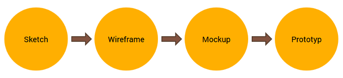

# Planen
Je nach Auftrag werden nun die möglichen Lösungsvarianten und das Vorgehen ausgearbeitet. Erstellen Sie einen Arbeitsablauf, indem Sie die einzelnen Arbeitsschritte planen. Im Arbeitsablauf werden Hilfsmittel und Werkzeuge ermittelt sowie der Zeitbedarf für die Arbeitsschritte geschätzt. Bei Arbeiten im Team werden die einzelnen Arbeitsschritte sinnvoll verteilt. Zudem werden Kriterien für die Kontrolle gesammelt. 

* Wie sehen der Zeitplan und die Priorität des Auftrags aus? 
* Welche Lösungsmöglichkeiten sind zu prüfen? 
* Welche Teilarbeiten von welcher Dauer sind zu erledigen? 
* Wer bearbeitet welche Teilaufgabe? 
* Welche Hilfsmittel und Tools werden gebraucht?

## Wireframes
Wireframe bedeutet so viel wie Drahtgerüst und ist eine schnelle und grobe Wiedergabe eines Designs. 

Mit einem Wireframe sollten folgende W-Fragen beantwortet werden:
* Die wichtigsten Inhaltselemente (WAS)
* Die Struktur der Informationen (WO)
* Die grundlegende Visualisierung der Benutzerschnittstellen (WIE)

### Einsatz von Wireframes
Wireframes werden hauptsächlich in der Anfangsphase eines Projektes verwendet um eine grobe Darstellung der Weblösung zu skizzieren. Sie können auch in einer weniger formellen Weise verwendet werden. Da sie schnell und einfach erstellt werden können, dienen sie als Skizzen für interne Besprechungen mit dem Team. Sie können Wireframes sowohl für grössere als auch für kleinere Aufgaben verwenden. Dies beseitigt Missverständnisse und ist extrem kostengünstig.

### Einordnung des Wireframes

### Hilfsmittel
* [Adobe XD](https://www.adobe.com/ch_de/products/xd.html) - Programm
* [Wireframe-Vorlage für Adobe XD](https://www.behance.net/gallery/55462459/Wires-free-wireframe-kits-for-Adobe-XD) -
 Design Kit
 
## Planung des Styleguides
Styleguides sind definierte Rahmenbedingungen und Standards für die gestalterische Umsetzung einer Website (oder anderen Oberfläche). Die Styleguides werden gemeinsam mit dem Kunden definiert und vereinfachen die Kommunikation zwischen dem Auftraggeber und der Agentur. 

Ziel des Styleguides ist es, die Präferenzen, Ziele und Wünsche des Kunden in einem möglichst frühen Projektstadium zu erfassen. Dadurch ist es möglich, zielgerichtetere Designvorschläge zu erstellen und darum die Anzahl der benötigten Varianten und Anpassungen zu verkleinern.

Ein Styleguide kann unter anderem Folgendes beinhalten:
* Wichtigste Schlüsselbergriffe (meistens Adjektive)
* Logo und sonstige firmenspezifische Grafikelemente
* Moodboard (Bilder und Formen)
* Definierte Hauptfarben
* Stil und Beispiel der verwendeten Icons
* Stil und Beispiel der Überschriften
* Stil und Beispiel des Fliesstextes
* Ausgewählte Designelemente (Buttons, Felder, Navigation etc.)

### Hilfsmittel
* [Styleguide für Adobe XD](res/styleguide.xd)

## Exkurs: Usability

### 1. Der erste Eindruck
Die Website repräsentiert ein Unternehmen und ein Angebot. Besucher, die den Auftritt zum ersten mal sehen, beschäftigen sich typischerweise mit folgenden Fragen:
* Ist diese Seite vertrauenswürdig?
* Wie steht es um die Professionalität des Unternehmens?
* Fühle ich mich von der Seite angesprochen?
* Finde ich hier, was ich suche?

Tipps für einen guten ersten Eindruck:
#### Passendes Farbkonzept
Bei jedem Internetauftritt sollten Farben verwendet werden, welche zur Zielgruppe zum zum Angebot passen. Dabei ist weniger mehr, da die Besucher ansonsten schnell die Übersicht verlieren oder sogar überfordert sind. Die Farbauswahl einer Website kann daher auf 1-5 Farben geschränkt werden.

[Adobe Kuler für das Farbkonzept](https://color.adobe.com/)

#### Animationen, Gadgets und Musik
Ein Element auf der Website zu platzieren, nur weil es irgenwie cool aussieht, ist eine schwache Strategie. Der Einsatz von Animationen, Gadgets und Musik ist nur dann sinnvoll, wenn dadurch für den Nutzer ein Mehrwert entsteht.

#### Layout und Seitenstruktur
Das A und O für einen übersichtlichen Internetauftritt ist einen einfache und klare Navigationsstruktur und ein klar strukturierter Seiteninhalt, welche sich durch allen Seiten hindurch zieht. Der Besucher sollte nicht mit zu vielen Informationen überhäuft werden und Leerstellen sollten gezielt eingesetzt werden um die Seite aufzulockern.

#### Typographie
Die Schrift sollte lesbar, genug gross und in einer angenehmen Schriftfarbe sein. Auch im Web sollten übliche Text-Stilmittel wie Auflistungen, Absätze, Markerungen etc. sinnvoll eingesetzt werden. Dies steigert die Lesbarkeit und die Informationen können einfacher aufgenommen werden.

[Webschriften für die kommerzielle Verwendung](https://fonts.google.com/)

### 2. Konsistent bleiben
Es hat sich bewährt, das Design über den ganzen Auftritt konsistent und einheitlich zu gestalten. Es empfiehlt sich, die Farben, Layouts und Schriften möglichst über alle Seiten gleich zu halten. So kann sich ein rundes Erlebnis für den User einstellen. Jedoch reicht ein einziges Layout selten für einen kompletten Internetauftritt.

Typischerweise benötigt man mindestens drei Layouts: eines für die Startseite, eines für Inhaltsseiten/Folgeseite und eines für Formularseiten.

### 3. Die richtigen Bilder verwenden
Bilder können ein mächtiges Element einer Website sein und deshalb sollten Sie diese mit Bedacht einsetzen. Aus Bequemlichkeit verwenden zum Beispiel viele Unternehmen Stock-Images, die man auf Bilder-Portalen kaufen kann. Aber macht das wirklich Sinn?

Diverse Experimente haben die Wirkung von Stock-Bildern und echten Bildern mit Menschen aus den Unternehmen bezüglich Ihrer Wirkung bei der Lead-Generierung verglichen. Dabei ist herausgekommen, dass die echten Bilder bei der Wirkung die Stock-Bilder um 95% überragten. Wieso?

Weil man Stock-Bildern ansieht, dass sie kaum Relevanz im speziellen Kontext besitzen. Achten Sie also bei der Bilderwahl auf deren Relevanz und deren Nähe zu den Texten auf der Seite.

### 4. Navigation
Wahrscheinlich einer der wichtigsten Faktoren, die über das Verbleiben des Besuchers auf einer Website entscheiden, ist ein klares, übersichtliches und intuitives Navigationssystem. In den meisten Fällen möchte ein Besucher möglichst schnell zu den Informationen, welche er benötigt. Mit diesem Ansatz sollte auch die Navigation realisiert werden. Denn wenn der Besucher nicht findet, was er sucht, wird er die Seite schnell wieder verlassen.

Die wichtigsten Fragen eines Besuchers sind somit: 

1. Wo bin ich? Was ist das? (Orientierung)	
1. Wie komme ich zu XY?	(Navigation)

Mögliche Grundsätze für eine gute Navigation sind:
* Der Navigationslink sollte offensichtlich und unmissverständlich sein
* Maximal sieben Navigationspunkte pro Ebene
* Jede Seite sollte mit maximal drei Klicks erreichbar sein
* Der Besucher sollte jederzeit wissen, wo er sich gerade befindet

Die Übergreifende Regel ist einfach: Verlange nie von einem Besucher, dass er nachdenken muss, wie er seine Informationen findet – **Don’t make me think!**

### 5. Flash und Animationen
Flash-Animationen können Aufmerksamkeit erzeugen. Genauso können sie Seitenbesucher von einer Webseite verjagen. Viele Leute  fühlen sich durch unerwartete Geräusche und Animationen gestört - vor allem am Arbeitsplatz. Animationen sollten nur dann eingesetzt werden wenn Sie wirklich nötig und sinnvoll sind.

### 6. Zugänglichkeit sicher stellen
Es muss sichergestellt werden, dass wirklich jeder Ihre Seite besuchen kann, unabhängig vom Browser (ausgenommen extrem alte Versionen) oder Gerät. Mittlerweile erfolgt fast jeder zweite Internetzugriff über ein mobiles Gerät. Es wäre sehr schade, wenn die Hälfte der potenziellen Website-Besucher abspringen, weil die Webseite via Smartphones und Tablets nicht optimal funktioniert.
