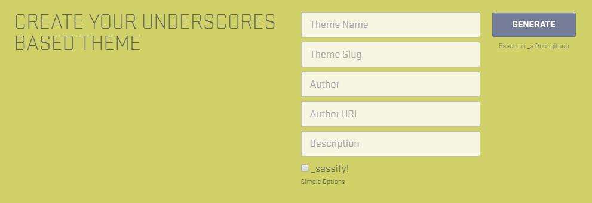

# Theme Installation
Das installierte Standard-Theme besitzt bereits über ein ausgeprägtes Aussehen. Um daraus ein individuelles Theme zu gestalten müsste zuerst 90% des bestehenden Codes (Styles, Struktur etc.) entfernt werden. Um diese Zeit einzusparen, kann ein sogenanntes Blank-Theme installiert werden. Das Theme besitzt über fast keine definierten Einstellungen und bietet daher die ideale Ausgangslage für die Erstellung eines eigenen Themes.

[Blank-Theme von underscores.me](http://underscores.me/)

Erstelle nun ein Blanktheme und installiere es manuell über das Backend. Nach der Installation kannst Du das Theme gleich aktivieren und dir das Ergebnis anschauen.