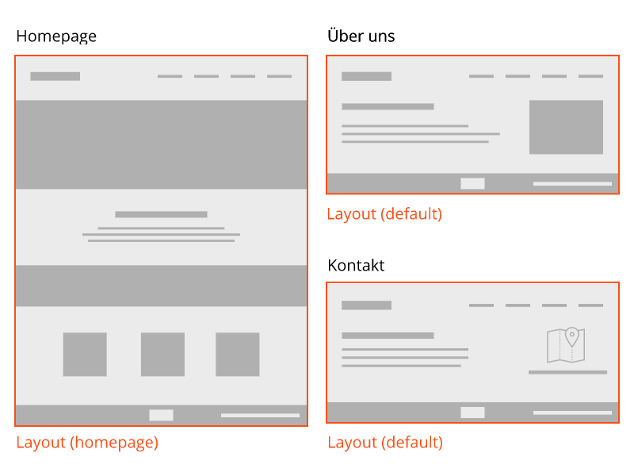

# Layouts

Eure Website wird sich aus verschiedenen Layouts zusammensetzen. Ein Layout ist die oberste Organisationsebene für alle weiteren Theme-elemente.

Im Beispiel unten gibt es zwei Layouts. Ein Layout namens `homepage` und ein Layout für die restlichen Seiten (`default`).

