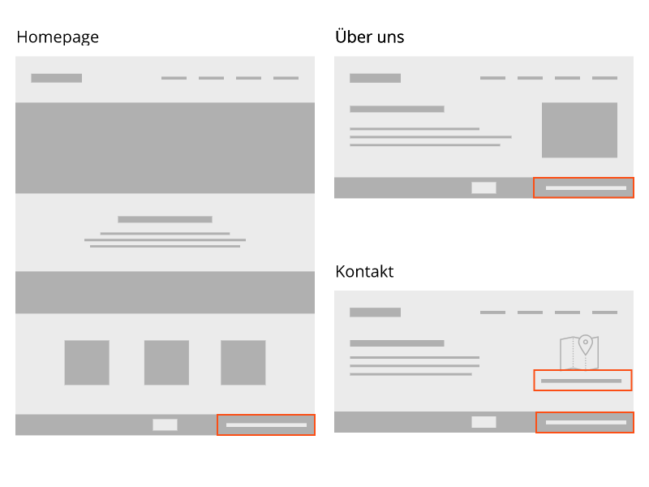

# Content (Inhalte)

Content verhält sich ähnlich wie Partials, mit dem Unterschied, dass er vom Endanwender bearbeitet werden kann.

Content kann an verschiedensten Orten im Theme eingebunden werden. Ein typisches Beispiel für Content ist eine Postanschrift oder eine Telefonnummer, die im Footer aber auch bei Kontaktformular angezeigt wird.

