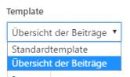

# Benutzerdefinierte Seitenlayouts
Sollten die vorgesehnen fünf Seitenlayouts nicht ausreichen, können noch weitere hinzugefügt und genutzt werden. Dazu kann im Template-Ordner eine neue PHP-Datei erstellt werden.

Damit Wordpress das neue Seitenlayout erkennt, muss der folgende Kommentar auf der ersten Zeile des benutzerdefinierten Seitenlayouts hinterlegt werden:

##### beispiel.php
```
<?php /* Template Name: NAME DES LAYOUTS */ ?>
```

Anschliessend kann das neue Layout in der Seitenbearbeitung im Backend ausgewählt werden:

