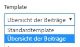

# Seiten
Wordpress kennt von hausaus drei verschiedene Seitenlayouts:

| Datei       | Layout für...     | Beschreibung                                                                                                                                                             |
|-------------|-------------------|--------------------------------------------------------------------------------------------------------------------------------------------------------------------------|
| index.php   | Startseite        | Standard-Startlayout für das Template und   somit auch der gesamten Website. Diese Layout wird aufgerufen, wenn keine   spezifische URI angegeben wurde.                 |
| single.php  | Einzelner Beitrag | Standardlayout für die Anzeige eines einzelnen Beitrages. Diese Ansicht   wird angezeigt, wenn ein einzelner Beitrag ohne benutzerdefiniertes Layout   ausgewählt wurde. |
| archive.php | Alte Beiträge     | Standardlayout für die Anzeige von vergangenen Beiträgen. Diese Ansicht   wird angezeigt, wenn das Archiv der Website aufgerufen wird.                                   |
| page.php    | Einzelne Seite    | Standardlayout für die Anzeige einer einzelnen Seite. Diese Ansicht wird   angezeigt, wenn eine einzelne Seite ohne benutzerdefiniertes Layout   ausgewählt wurde.       |
| search.php  | Suchresultate     | Standard-Suchresultatelayout für das Template. Diese Ansicht wird   angezeigt, wenn jemand eine Suchanfrage mit dem Suchfeld durchgeführt hat.                           |


## `index.php` - Startseite
Anhand der Datei index.php wird im folgenden die Templating-Sprache von Wordpress aufgezeigt und erklärt:

```php
<?php
/**
 * The main template file
 * ...
 * 
 */

get_header(); ?>

    <div id="primary" class="content-area">
        <main id="main" class="site-main" role="main">

        <?php
        if ( have_posts() ) :

            if ( is_home() && ! is_front_page() ) : ?>
                <header>
                    <h1 class="page-title screen-reader-text"><?php single_post_title(); ?></h1>
                </header>

            <?php
            endif;

            /* Start the Loop */
            while ( have_posts() ) : the_post();

                /*
                 * Include the Post-Format-specific template for the content.
                 * If you want to override this in a child theme, then include a file
                 * called content-___.php (where ___ is the Post Format name) and that will be used instead.
                 */
                get_template_part( 'template-parts/content', get_post_format() );

            endwhile;

            the_posts_navigation();

        else :

            get_template_part( 'template-parts/content', 'none' );

        endif; ?>

        </main><!-- #main -->
    </div><!-- #primary -->

<?php
get_sidebar();
get_footer();
```

#### get_{FILENAME}
Mit den verschiedenen get-Funktionen (get_header, get_footer, get_sidebar) werden die verschiedenen Template-Teile aus anderen Dateien in die Datei `index.php` geladen.

Der Befehl `get_header();` ist somit gleichwertig mit den normalen Include-Befehl `include 'header.php;`.

####  have_posts()
Der Befehl `have_posts()` gibt einen Boolean zurück, ob mindestens ein Post vorhanden ist. Mit dem IF-Konstrukt wird also überprüft, ob der nachfolgende Code für die Anzeige der Inhalte überhaupt ausgeführt werden muss.

**Wichtig**: Wordpress unterscheidet bei dieser Überprüfung nicht zwischen Seiten und Beiträgen.

```php
    <?php
    if ( have_posts() ) :   // Code wird nur ausgeführt, wenn Posts vorhanden sind.
        
        ...

    else :                  // Code wird ausgeführt, wenn kein Post vorhanden ist.

        get_template_part( 'template-parts/content', 'none' );

    endif; ?>
```

Die Funktion hat noch eine zweite Aufgabe: Wird die Funktion in einem While-Konstrukt aufgerufen, gibt diese solange ein `TRUE` zurück, bis alle Posts durchlaufen wurden. Dazu muss die While-Schleife jedoch noch die Funktion `the_post()` (siehe unten) beinhalten.

### the_post()
Wird die Funktion `the_post()` in einer While-Schlaufe aufgerufen, werden die einzelnen Post nacheinander in die dafür vorgesehen `the_`-Funktionen geladen. Am Schluss der Schlaufe, stellt die Funktion noch den Rückgabewert der Funktion `have_posts()` auf `FALSE`, um die Schlaufe zu unterbrechen.

```php
    while ( have_posts() ) : // Gibt solange ein TRUE zurück, bis sämtliche POST durchlaufen wurden.
        
        the_post(); // Speichert die Informationen des Post pro Durchlauf in die daführ vorgesehnen 'the_'.Funktionen.

        get_template_part( 'template-parts/content', get_post_format() );

    endwhile;
```

### `the_`-Funktionen
Um auf die verschiedenen Informationen eines Post während einem SCĉhlaufen-Durchlauf zugreifen zu könnenm werden diese in sogenannte `the_`-Funktionen gespeichert.

| Funktion       | Gespeicherte Informationen |
|----------------|----------------------------|
| the_title()    | Titel des Posts            |
| the_content()  | Inhalt des Posts           |
| the_category() | Kategorie des Posts        |

Eine abschliessende Auflistung der `the_`-Funktionen befindet sich auf der offiziellen [Wordpress-Dokumentation](https://wordpress.org/search/the_).

### get_template_part()
Die verschiedenen Post-Informationen sollen angezeigt werden, nachdem sie mit der `the_post();`-Funktion geladen wurden. Je nach Post-Typ (Seite, Beitrag) gibt es dabei unterschiedliche Anforderungen an die Struktur des Inhaltes. Aus diesem Grund können unterschiedliche Vorlagen für die Anzeige von Posts im Ordner `template-parts/` erfasst werden.

```text
.content        =>      Vorlage für die Anzeige von Beiträgen.
.content-none   =>      Vorlage für die Anzeige, falls kein Post vorhanden ist.
.content-page   =>      Vorlage für die Anzeige von Seiten.
.content-search =>      Vorlage für die Anzeige von Suchresultaten.
```

Mit der Funktion `get_template_part()` kann der Inhalt der Datei definiert werden, welcher an dieser Stelle eingefügt werden soll.

Die Funktion benötigt dazu zwei Parameter:
1. Name des allgemeinen Template-Parts.
1. Name der spezifischen Template-Part-Variation (none, page, search)

Zur Verdeutlichung einige Beispiele:
```php
    get_template_part( 'template-parts/content' );          => include 'tempaltes-parts/content.php'
    get_template_part( 'template-parts/content', 'page' );  => include 'tempaltes-parts/content-page.php'
    get_template_part( 'template-parts/content', 'none' );  => include 'tempaltes-parts/content-none.php'
```

## Benutzerdefinierte Seitenlayouts
Sollten die vorgesehnen fünf Seitenlayouts nicht ausreichen, können noch weitere hinzugefügt und genutzt werden. Dazu kann im Template-Ordner eine neue PHP-Datei erstellt werden.

Damit Wordpress das neue Seitenlayout erkennt, muss der folgende Kommentar auf der ersten Zeile des benutzerdefinierten Seitenlayouts hinterlegt werden:

##### beispiel.php
```
<?php /* Template Name: NAME DES LAYOUTS */ ?>
```

Anschliessend kann das neue Layout in der Seitenbearbeitung im Backend ausgewählt werden:

