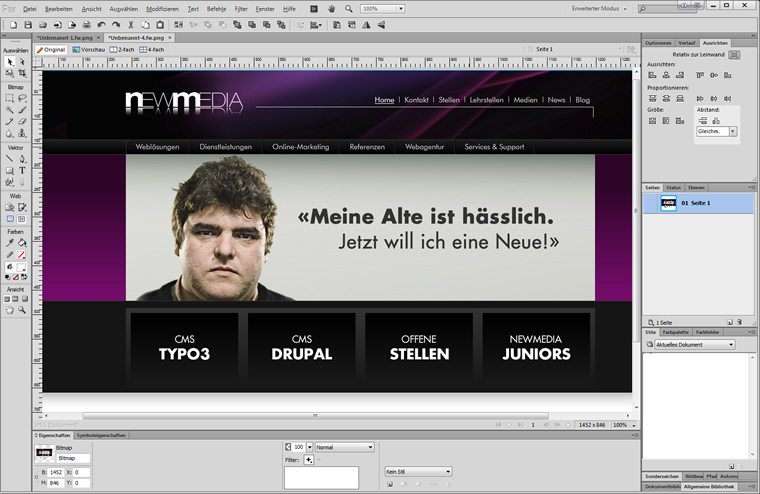
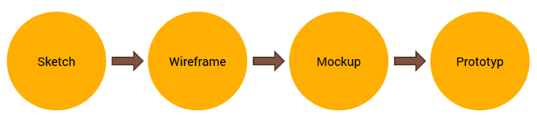

## Mockup gestalten

### Was ist ein Mockup
Nach der Erstellung eines Wireframes erfolgt häufig der nächste Schritt in einem Mockup. Dem Wireframe wird sozusagen ein Gesicht gegeben. Der Webdesigner gestaltet mit Farben, Typografie, Bildern und Grafikelementen einen Designentwurf. Er entwickelt die einzelnen Elemente der Gestaltung für die verschiedenen Seitenansichten wie z.B. die Startseite, Inhaltsseiten oder Kontaktformulare. Das statische Design gibt bereits einen guten Einblick wie die Website später im Webbrowser aussieht, das «Look & Feel» der späteren Website.

Wichtig dabei ist, dass es sich um ein statisches Bild, einen Entwurf, handelt und häufig nur mit Füllbildern und Texten gearbeitet wird. Es zeigt nicht die fertige Lösung an und dies kann manchmal zu Missverständnissen führen.

Ein gut angelegtes Mockup...
* ...stellt die Struktur der Informationen dar
* ...sisualisiert den Inhalt und demonstriert die grundlegende Funktionalität in einer statischen Weise
* ...unterstützt die gestalterische Prüfung der Layouts

### Einsatz von Mockups
Mockups sind besonders nützlich um einen ersten Eindruck der fertigen Website zu vermitteln und werden häufig zu Präsentationszwecken erstellt.

### Einordnung des Mockups

