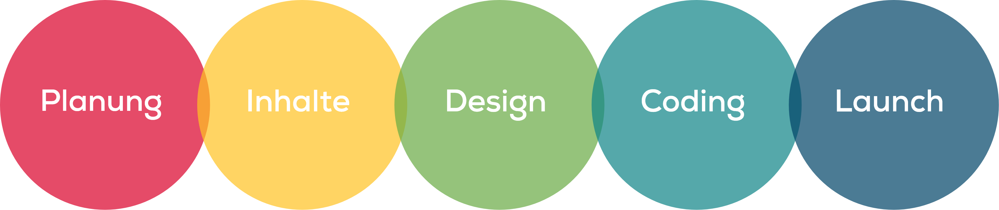
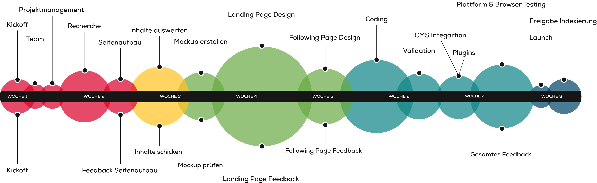

# Realisation Website
Normalerweise besteht die Realisation einer kompletten Website aus folgenden Phasen:

Diese teilen sich wiederum in folgende Arbeitsschritt auf:

[Übersicht als PDF](src/OFFILNE_Erklaerung_Webprojektablauf.pdf)