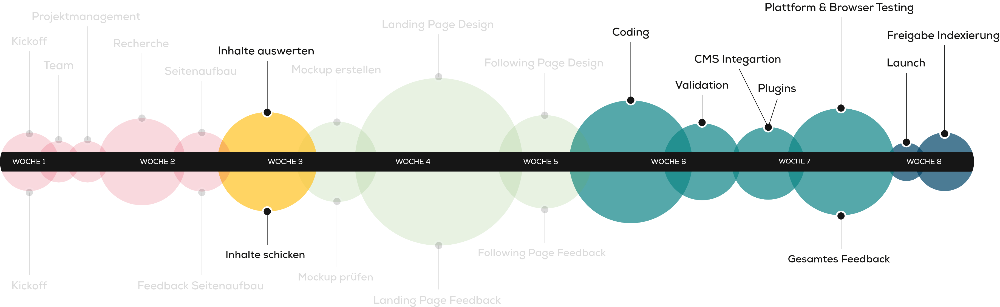

# Projektauftrag
In den kommenden fünf Kurstagen sind wir als Kursgruppe eine kleine Webagentur. Die Agentur besteht aus verschiedenen Arbeitsgruppen aus jeweils zwei Personen. Ziel der Gruppe ist es, in den nächsten fünf Tage eine dynamische Website zu realisieren. Die Inhalte der Seite sollen dabei mit Hilfe eines CMS verwaltet werden. Das Design wurde dabei bereits von einer Grafikagentur erarbeitet. Somit geht es im Projekt in erster Linie um die technische Umsetzung und die Erarbeitung der Inhalte.

## Einordnung der Projektarbeit

[Übersicht als PDF](src/abgrenzung-website.pdf).

## Grobziele des Projektes
- Umsetzung eines Layouts in HTML/CSS
- Umsetzung des Design in eine responsive Darstellung
- Implementierung in einem Inhaltsverwaltungssystem (CMS)
- Integration und Anpassung von bestehenden Plugins
- Erstellung und Integration von eigenen Plugins
- Veröffentlichung eine Webauftritts
- Präsentation der Arbeit an den Auftraggeber

## Bewertung
1. Projektarbeit (100%)
2. Selbst-Sozialkompetenz (informativ)