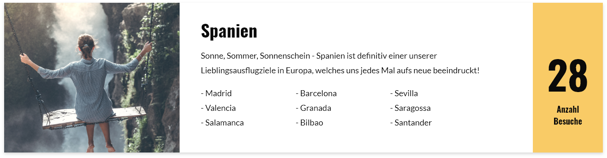
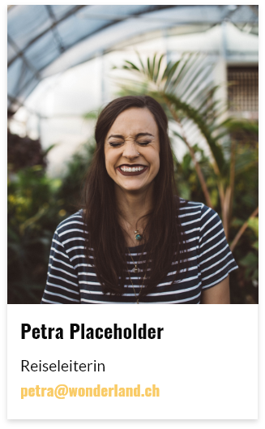

# Reiseblog
Das Team rund um den Travelblog «Wonderland» möchte einen neuen Internetauftritt. Der Travelblog besteht aus folgenden Seiten:

##### Startseite
Auf der Startseite soll der Besucher einen Überblick darüber erhalten, was ihn auf dieser Seite erwartet. Der Inhalt dieses Bereichs wird regelmässig ausgetauscht. Auch sollen auf der Startseite die drei neusten Blogbeiträge angeteastert werden, um den Besucher in den Blog-Bereich zu locken.

##### Reiseblog
Der Blog besteht aus zwei Arten von Seiten:  Zum einen sollen sämtliche Blog-Einträge auf einer Übersichtsseite in umgekehrtchronologischer Reihenfolge angezeigt werden. Zum anderen kann man sämtliche Inhalte eines Blogs mit Klick auf einen Beitrag ansehen.

##### Destinationen
Auf der Seite «Destinationen» soll eine Liste sämtlicher Destinationen erscheinen, welche die Reiseblogger bereits besucht haben. Dabei können die besuchten Städte und die Anzahl Besuche erfasst und angezeigt werden.

Auf der alten Website wurde der Bereich wie folgt dargestellt:

##### FAQ
Auf der Seite «FAQ» wird eine einfache Liste mit den häufigsten Fragen und Antworten von den Followern angezeigt. Die einzelnen Punkte sollen dabei kurz und knapp gehalten werden.

Um den Inhalt dieses Bereich besser abzuschätzen, hat uns das Wonderland folgendes Beispiel geschickt:

###### Frage 
>Wie beste Art um in einem Bus zu schlafen?

###### Antwort 
> Einige erfahrene Reisende schwören auf den sogenannten Knockout-Cocktail, dieser besteht aus 3 Pfefferminz-Bonbon, einem ordentlichen Schuss Honig und das alles verrührt in einem Sabeitee. Es gibt jedoch auch andere Möglichkeiten - einschliesslich Übungen vor der Fahrt oder ein paar Tropfen ätherisches Lavendelöl.

##### About us
Auf der Seite «About us» werden sämtliche Teammitglieder mit Foto, Name, Funktion und Email-Adresse vorgestellt.

Auf der alten Website wurde der Bereich wie folgt dargestellt:

##### Konzept
Auf der Seite «Konzept» möchte Wonderland in einem kurzen Text ihren Leser und Leserinnen erklären, was Wonderland so speziell macht. Der Text ist leider noch nicht soweit, aber die Anforderungen dazu sind schon klar:

* Einleitung à ca. 100 Wörter
* drei Absätze à ca. 200 Wörter

Das Wonderland-Team arbeitet konstant an ihrem Konzept - entsprechend soll es auch durch das Team einfach verwaltbar sein.

##### Kontakt
Auf der Kontaktseite können Website-Besucher eine Nachricht an das Team per Kontaktformular senden. Ausserdem wird eine Google-Maps mit dem Hauptsitz der Wonderland AG angezeigt (die Adresse ist noch unklar und kann deshalb frei von euch gewählt werden).

Folgende (Pflicht-)Felder sollen über das Formular gesendet werden können:

| Bezeichnung                       | Typ      | Pflichfeld? |
|-----------------------------------|----------|-------------|
| Vorname                           | string   | ja          |
| Nachname                          | string   | ja          |
| Email                             | email    | ja          |
| Interesse an welcher Destination? | dropdown | ja          |
| Kommentar                         | textarea | nein        |

### Benutzerstruktur
Im Vorfeld haben wir den Auftraggeber gefragt, wer welche Bereiche der neuen Website verwalten wird. Entsprechend müssen auch die Benutzer vorbereitet und die Rechte verteilt werden.

##### Wonderland-Administration
Die Administration verwaltet sämtliche Inhalte der Website. Entsprechen hat diese Zugriff auf alles, was nicht technisch ist.

##### Wonderland-Technik
Die Technik von Wonderland soll uneingeschränkten Zugriff auf alle Inhalte und technischen Bereiche der Website haben.

##### Externe Blogger
Neben den eigenen Blogbeiträgen schreiben zeitweise auch externe Blogger für uns. Diese sollen zwar selbständig Blogbeträge erfassen und verwalten können, jedoch sonst keine anderen Bereiche der Website.

### Styleguide
Das Styleguide des Kunden findet ihr [unter diesem Link.](../src/Styleguide%20Wonderland.pdf)

##### Logos & Grafiken
Dazu hier noch die verwendeten Logos und die Grafiken als Vektor-Dateien:

* [Dunkles Logo](src/logo_dark.svg)
* [Helles Logo](src/logo_white.svg)
* [Dunkle Grafik](src/figure_dark.svg)
* [Gelbe Grafik](src/figure_yellow.svg)
* [Design Guidelines](src/guidelines.jpg)   

##### Bildwelt
Gemeinsam mit dem Kunden wurde eine Bildwelt erarbeitet. Die auf der Website eingesetzten Bilder, sollten in einer ähnlichen Stimmung sein. Die Bilder können ohne Absprache mit dem Kunden ausgetauscht oder ergänzt werden.

* https://unsplash.com/photos/A5rCN8626Ck
* https://unsplash.com/photos/1Spvd7ktFX4
* https://unsplash.com/photos/9O1oQ9SzQZQ
* https://unsplash.com/photos/PGnqT0rXWLs
* https://unsplash.com/photos/fb7yNPbT0l8
