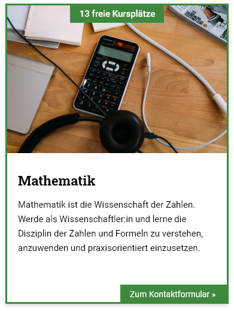
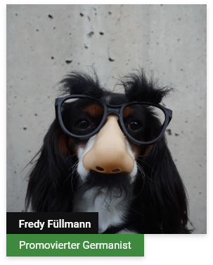

# Online Kurse
Das Team rund um die Online-Kurs-Website «Kursito» möchte einen neuen Webauftritt. Die Website besteht aus folgenden Seiten:

##### Startseite
Auf der Startseite soll prominent zum Lernblog und zu den Kursen verlinkt werden. Ausserdem wünscht der Kunde die Möglichkeit ein Zitat auf der Seite zu platzieren. Das Zitat soll in regelmässigen Abständen ausgetauscht werden. Im zweiten Teil der Seite sollen die drei neusten Blogbeiträge aus dem Lernblog präsentiert werden. 

##### Lernblog
Der Blog besteht aus zwei Arten von Seiten: Zum einen sollen sämtliche Blog-Einträge auf einer Übersichtsseite in umgekehrt chronologischer Reihenfolge angezeigt werden. Zum anderen kann man sämtliche Inhalte eines Blogs mit Klick auf einen Beitrag ansehen.

##### Kurse
Auf der Seite «Kurse» soll eine Liste sämtlicher Kurse erscheinen, welche Kursito anbietet. Dabei sollen die noch freien Kursplätze erfasst und angezeigt werden können.

Auf der alten Website wurde der Bereich wie folgt dargestellt:

##### FAQ
Auf der Seite «FAQ» wird eine einfache Liste mit den häufigsten Fragen und Antworten zu den Online-Kursen angezeigt.

Um den Inhalt dieses Bereich besser abzuschätzen, hat uns das Kursito-Team folgendes Beispiel geschickt:

###### Frage
> Unterstützen mich die Coaches nur fachlich?

###### Antwort
> Unsere Coaches sind zwar fachlich top, jedoch auf keinen Fall nur Fachidioten. So wissen sie, dass zum Lernen noch viel mehr dazu gehört als nur die fachliche Vermittlung des Schulstoffs. Der Coach hilft Dir also nicht nur ein Thema zu lernen, sondern dies auch besser und einfacher zu lernen!

##### Coaches
Auf der Seite «Coaches» werden sämtliche Teammitglieder mit Foto, Name und Ausbildung angezeigt.

Auf der alten Website wurde der Bereich wie folgt dargestellt:

##### Unsere Ansprüche
Das Kapital von Kursito sind die angestellten Coaches. Entsprechend möchte Kursito auf der Seite «Unsere Ansprüche» vermitteln, anhand welcher Kriterien die Coaches rekrutiert werden. Der TExt ist leider noch nicht soweit, aber die Anforderungen wurden bereits für den Texter definiert:

* Einleitung à ca. 200 Wörter
* ein Absatz à ca. 300 Wörter

Die Ansprüche werden laufend an den Gegebenheiten angepasst, entsprechend soll es auch für das Kursito-Team möglich sein, diesen Text einfach zu verwalten.

##### Kontakt
Auf der Kontaktseite können Website-Besucher eine Nachricht per Kontaktformular senden. Ausserdem wird eine Google-Maps mit dem Hauptsitz der Kursito AG angezeigt (die Adresse ist noch unklar und kann deshalb frei von euch gewählt werden).

Folgende (Pflicht-)Felder sollen über das Formular gesendet werden können:

| Bezeichnung                       | Typ      | Pflichtfeld? |
|-----------------------------------|----------|-------------|
| Vorname                           | string   | ja          |
| Nachname                          | string   | ja          |
| Email                             | email    | ja          |
| Interesse an welchem Kurs? | dropdown | ja          |
| Nachricht                         | textarea | nein        |

### Benutzerstruktur
Im Vorfeld haben wir den Auftraggeber gefragt, wer welche Bereiche der neuen Website verwalten wird. Entsprechend müssen auch die Benutzer vorbereitet und die Rechte verteilt werden.

##### Kursito-Sekretariat
Das Sekretariat verwaltet sämtliche Inhalte der Website. Entsprechend soll der Benutzer «sekretariat» eingerichtet werden, dieser hat auf alles Zugriff, was nicht technisch ist.

##### Kursito-Admin
Der «admin»-Benutzer von Kursito soll uneingeschränkten Zugriff auf alle Inhalte und technischen Bereiche der Website haben. So ist der Admin auch erste Anlaufstelle bei Problemen.

##### Coaches
Neben dem Sekretariat schreiben auch die Cloaches einzelne Blogbeiträge. Diese sollen mit dem Benutzer «coach» zwar selbständig Blogbeiträge erfassen und verwalten können, jedoch sonst keine anderen Bereiche der Website sehen.

### Styleguide
Den Styleguide des Kunden findet ihr [unter diesem Link.](../src/Styleguide%20Kursito.pdf)

##### Logos & Grafiken
Dazu hier noch die verwendeten Logos und die Grafiken als Vektor-Dateien:

* [Dunkles Logo](src/logo_dark.svg)
* [Helles Logo](src/logo_white.svg)
* [Dunkle Grafik](src/figure_dark.svg)
* [Grüne Grafik](src/figure_green.svg)
* [Design Guidelines](src/guidelines.jpg)

##### Bildwelt
Gemeinsam mit dem Kunden wurde eine Bildwelt erarbeitet. Die auf der Website eingesetzten Bilder, sollten in einer ähnlichen Stimmung sein. Die Bilder können ohne Absprache mit dem Kunden ausgetauscht oder ergänzt werden.

* https://unsplash.com/photos/XkKCui44iM0
* https://unsplash.com/photos/zGn2cg9qBvU
* https://unsplash.com/photos/lUaaKCUANVI
* https://unsplash.com/photos/egbB-zLBeDo
* https://unsplash.com/photos/wD1LRb9OeEo
* https://unsplash.com/photos/xG8IQMqMITM
