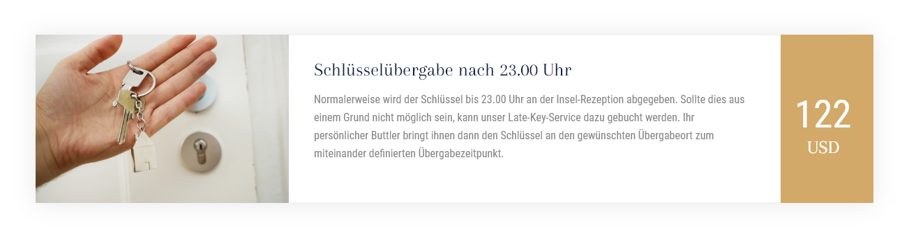

# Nexus
Das Team von Nexus möchte eine neue Verkaufswebsite. Die Website besteht aus folgenden Seiten:

#### Allgemein
Auf jeder Seite soll der Standort des Hauptsitz via Google-Maps angezeigt werden (die Adresse ist noch unklar und kann deshalb frei von euch gewählt werden).

##### Startseite
Auf dem Bild auf der Startseite soll eine präsente Überschrift und Kurztext platziert werden. Dieser wird in regelmässigen Abständen ausgetauscht. Im zweiten Teil der Seite sollen die drei neusten Blogbeiträge präsentiert werden.

##### Inselblog
Der Blog besteht aus zwei Arten von Seiten: Zum einen sollen sämtliche Blog-Einträge auf einer Übersichtsseite in umgekehrt chronologischer Reihenfolge angezeigt werden. Zum anderen kann man sämtliche Inhalte eines Blogs mit Klick auf einen Beitrag ansehen.

##### Services
Auf der Seite «Services» soll eine Liste sämtlicher Services erscheinen, welche Nexus anbietet. Dabei kann der Preis des entsprechenden Service erfasst und angezeigt werden.

Auf der alten Website wurde der Bereich wie folgt dargestellt:

##### FAQ
Auf der Seite «FAQ» wird eine einfache Liste mit den häufigsten Fragen und Antworten von den Interessenten angezeigt.

Um den Inhalt dieses Bereichs besser abzuschätzen, hat uns Nexus folgendes Beispiel geschickt:

###### Frage
> Gibt es schlechte Inseln?

###### Antwort
> Nein, es gibt keine schlechten Inseln, es gibt wohl nur falsche Erwartungen. So versuchen wir mit unseren Kunden immer möglichst offen und ehrlich zu sprechen, damit es am Schluss keine Enttäuschen gibt. Aus diesem Grund haben wir auch eine 100%-Zufriedenheitsgarantie bei einem Inselkauf.

##### Unternehmen
Auf der Seite «Unternehmen» werden sämtliche Teammitglieder mit Foto, Name, Telefon und Email-Adresse angezeigt.

Auf der alten Website wurde der Bereich wie folgt dargestellt:

##### Glück
Auf der Seite «Glück» möchte Nexus kurz ihren Begriff von Glück erörtern und wie dieser mit dem Kauf einer Insel zusammenhängt. Der Text ist leider noch nicht soweit, aber die Anforderungen dazu sind schon klar:

* Einleitung à ca. 50 Wörter
* zwei Absätze à ca. 200 Wörter

Das Nexus-Team ist sich im Klaren, dass der Text noch lange nicht fertig ist  - entsprechend soll dieser auch durch das Team einfach verwaltbar sein.

Da der Text erst kurz vor GoLive fertig sein wird, kann hier mit Fülltext gearbeitet werden.

##### Anfragen
Auf der Anfrageseite können Website-Besucher eine konkrete Anfrage für eine bestimmte Instel via Kontaktformular stellen.

| Bezeichnung                       | Typ      | Pflichtfeld? |
|-----------------------------------|----------|-------------|
| Vorname                           | string   | ja          |
| Nachname                          | string   | ja          |
| E-Mail                             | email    | ja          |
| Interesse an welcher Insel? | dropdown | ja          |
| Spezial-Wünsche                         | textarea | nein        |

### Benutzerstruktur
Im Vorfeld haben wir den Auftraggeber gefragt, wer welche Bereiche der neuen Website verwalten wird. Entsprechend müssen auch die Benutzer vorbereitet und die Rechte verteilt werden.

##### Nexus-Marketing
Das Marketing-Team verwaltet sämtliche Inhalte der Website. Entsprechend soll der Benutzer «marketing» eingerichtet werden, dieser hat auf alles Zugriff, was nicht technisch ist.

##### IT-Abteilung
Der «admin»-Benutzer von Nexus soll uneingeschränkten Zugriff auf alle Inhalte und technischen Bereiche der Website haben. So ist der Admin auch erste Anlaufstelle bei Problemen.

##### Insel-Besitzer
Neben dem internen Marketing schreiben zeitweise auch externe Besitzer von Inseln für uns Erfahrungsbeiträge. Diese sollen mit dem Benutzer «owner» zwar selbständig Blogbeiträge erfassen und verwalten können, jedoch sonst keine anderen Bereiche der Website sehen.

### Styleguide
Den Styleguide des Kunden findet ihr [unter diesem Link.](../src/Styleguide%20Nexus.pdf)

##### Logos & Grafiken
Dazu hier noch die Logos und die Grafiken als Vektor-Dateien:

* [Goldiges Logo](src/logo_gold.svg)
* [Helles Logo](src/logo_white.svg)
* [Design Guidelines](src/guidelines.jpg)

##### Bildwelt
Nexus hat noch keine Bildwelt und ist darum offen für eure Vorschläge. Der Kunde wäre also froh um eure Inputs beim Kundenbriefing.