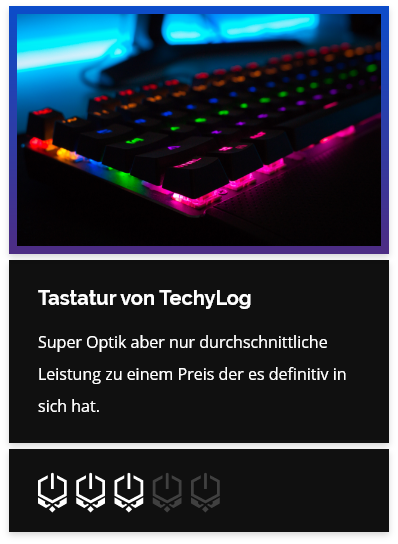
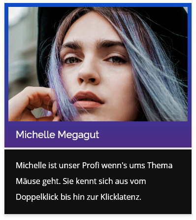

# Techowl
Die Techowls möchte eine neue Website für ihre Technik-Website. Der Internetauftritt besteht aus folgenden Seiten:

##### Startseite
Auf der Startseite soll prominent auf die Hauptteile (Blog, Test und About) der Website verwiesen werden. Im zweiten Teil der Seite sollen die vier neusten Blogbeiträge präsentiert werden.

##### Techblog
Der Blog besteht aus zwei Arten von Seiten: Zum einen sollen sämtliche Blog-Einträge auf einer Übersichtsseite in umgekehrt chronologischer Reihenfolge angezeigt werden. Zum anderen kann man sämtliche Inhalte eines Blogs mit Klick auf einen Beitrag ansehen.

##### Tests
Auf der Seite «Tests» soll eine Liste sämtlicher Tests erscheinen, welche die Techowls gemacht haben. Dabei soll zu jedem Test das Ergebnis erfasst und angezeigt werden können.

Auf der alten Website wurde der Bereich wie folgt dargestellt:

##### Wissen
Auf der Seite «Wissen» wird eine einfache Liste mit dem Fachgebiet und dem dazugehörigen Wissen angezeigt.

###### Fachgebiet
> Linkshändigkeit

###### Wissen
> Aktuelle, ergonomisch geformte Mäuse haben häufig das Problem, dass sie lediglich für die Nutzung durch Rechtshänder konstruiert wurden. Linkshänder können solche Mäuse meist überhaupt nicht oder nur unter extremer Fehlhaltung benutzen. Da es von den meisten ergonomisch geformten Mäusen keine Linkshändervariante gibt, lernen viele Linkshänder, ihre Maus auch mit der rechten Hand zu verwenden.

##### Techowls
Auf der Seite «Techowls» werden sämtliche Teammitglieder mit Foto, Name und Beschreibung angezeigt.

Auf der alten Website wurde der Bereich wie folgt dargestellt:

##### Geschichte
Die Techowls schauen auf eine lange Geschickte zurück. Entsprechend möchten sie diese auch von einem Texter aufbereiten lassen und auf der Seite «Geschichte» präsentieren. Der Text ist leider noch nicht soweit, aber die Anforderungen dazu sind schon klar:

* Einleitung à ca. 200 Wörter
* vier Absätze à ca. 150 Wörter

Die Geschichte der Techows ist aber noch lange nicht fertig geschrieben  - entsprechend soll diese auch durch das Team einfach erweiterbar sein.

Da der Text erst kurz vor GoLive fertig sein wird, kann hier mit Fülltext gearbeitet werden.

##### Kontakt
Auf der Kontaktseite können Website-Besucher eine Nachricht per Kontaktformular senden. Ausserdem wird eine Google-Maps mit dem Hauptsitz von den Techowls angezeigt (die Adresse ist noch unklar und kann deshalb frei von euch gewählt werden).

| Bezeichnung                       | Typ      | Pflichtfeld? |
|-----------------------------------|----------|-------------|
| Vorname                           | string   | ja          |
| Nachname                          | string   | ja          |
| E-Mail                             | email    | ja          |
| Telefon | string | nein          |
| Interesse an welchem Produkt?                        | dropdown | ja        |

### Benutzerstruktur
Im Vorfeld haben wir den Auftraggeber gefragt, wer welche Bereiche der neuen Website verwalten wird. Entsprechend müssen auch die Benutzer vorbereitet und die Rechte verteilt werden.

##### Techowls
Das Team verwaltet sämtliche Inhalte der Website selber. Entsprechend soll der Benutzer «techowl» eingerichtet werden, dieser hat auf alles Zugriff, was nicht technisch ist.

##### IT-Abteilung
Einzelne Personen vom IT-Team sollen ausserdem uneingeschränkten Zugriff auf alle Inhalte als «admin»-Benutzer haben. So ist das IT-Team auch erste Anlaufstelle bei Problemen.

##### Externe Blogger
Neben dem Techowl-Team schreiben zeitweise auch externe Gastautoren Beiträge für den Blog. Diese sollen mit dem Benutzer «blogger» zwar selbständig Blogbeiträge erfassen und verwalten können, jedoch sonst keine anderen Bereiche der Website sehen.

### Styleguide
Den Styleguide des Kunden findet ihr [unter diesem Link.](../src/Styleguide%20Techowls.pdf)

##### Logos & Grafiken
Dazu hier noch die Logos und die Grafiken als Vektor-Dateien:

* [Logo mit Verlauf](src/logo_gradient.svg)
* [Helles Logo](src/logo_white.svg)
* [Dunkle Grafik](src/figure_dark.svg)
* [Grafik mit Verlauf](src/figure_gradiant.svg)
* [Design Guidelines](src/guidelines.jpg)

##### Bildwelt
Gemeinsam mit dem Kunden wurde eine Bildwelt erarbeitet. Die auf der Website eingesetzten Bilder sollten in einer ähnlichen Stimmung sein. Die Bilder können ohne Absprache mit dem Kunden ausgetauscht oder ergänzt werden.

* https://unsplash.com/photos/m3hn2Kn5Bns
* https://unsplash.com/photos/nCU4yq5xDEQ
* https://unsplash.com/photos/XM40OT9lIFM
* https://unsplash.com/photos/dwcC-OJ-bRs
* https://unsplash.com/photos/zpxKdH_xNSI
