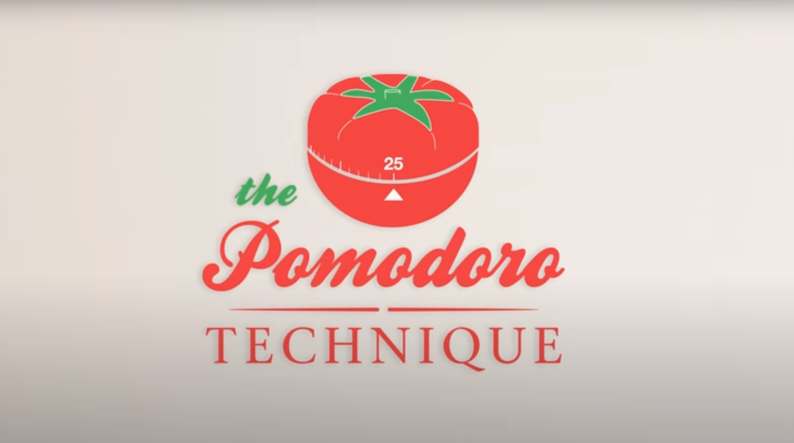
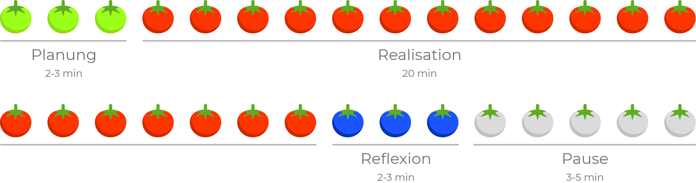
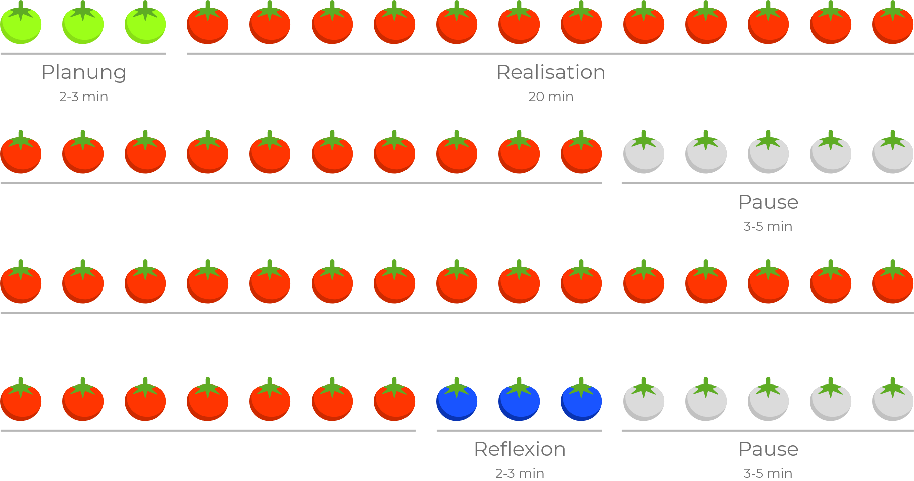

# Die Pomodoro-Technik

Die Pomodoro-Technik ist eine Arbeitsmethode um eine grosse Aufgabe in kleine Tomaten (ital. Promodoro) à 30 Minuten zu unterteilen. Sie wurde von Francesco Cirillo erfunden, der die Technik nach seinem tomatenförmigen Wecker benannt hat.

## Die 5-Schritte von Promodoro
Die Promodoro-Technik besteht grundsätzlich aus folgenden 5 Schritten.

1. Aufgabe schriftlich Formulieren
2. Wecker auf 25 Minuten einstellen
3. Aufgabe bearbeiten, bis der Wecker klingelt
4. Aufgabe durchstreichen und eine kurze Pause machen
5. nach spätestens vier Promodori eine längere Pause einlegen

### 25 Minuten optimal nutzen
Um die 25 Minuten optimal zu nutzen, sollten diese nicht nur für die Bearbeitung der Aufgabe genutzt werden, sondern auch für die Planung und Reflexion. Nehmt euch also auch Zeit, um die Bearbeitung eurer Aufgabe zu planen und zu reflektieren. Im Idealfall, werden werden die 25 Minuten wie folgt genutzt.

##### Normaler Ablauf eines Promodoro

### Promodori kombinieren
Für grössere Arbeiten können auch mehrere Promodori miteinander kombiniert werden. Dabei wird beispielsweise die Realisationsdauer eines Promodori verlängert und die Reflexion erst anschliessend durchgeführt.

##### Möglichkeit um Promodori für längere Aufgaben zu kombinieren

