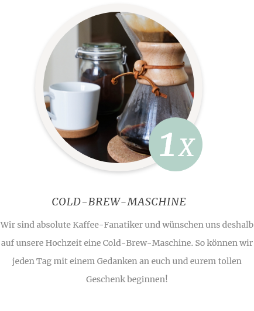

# Online Kurse
Peter und Karin möchten für ihre Hochzeit eine Website erstellen. Die Website besteht aus folgenden Seiten:

##### Startseite
Auf der Startseite soll als erstes das Brautpaar mit Foto und Namen präsentiert werden. Im zweiten Teil der Seite sollen die drei neusten Blogbeiträge präsentiert werden. 

##### Hochzeitsblog
Der Blog besteht aus zwei Arten von Seiten: Zum einen sollen sämtliche Blog-Einträge auf einer Übersichtsseite in umgekehrt chronologischer Reihenfolge angezeigt werden. Zum anderen kann man sämtliche Inhalte eines Blogs mit Klick auf einen Beitrag ansehen.

##### Wunschliste
Auf der Seite «Wunschliste» soll eine Liste sämtlicher Wünsche des Hochzeitspaar erscheinen. Dabei soll angezeigt werden, wie viel sich das Hochzeitspaar von etwas wünscht.

Die Hochzeits-Website eines befreundeten Paars hatte auch einen solchen Bereich und entspricht im Inhalt dem, was sich auch Peter und Karin wünschen:

##### Informationen
Auf der Seite «Informationen» wird eine einfache Liste mit den verschiedenen Themen zur Hochzeit und den dazugehörigen Informationen angezeigt.

Die Informationen bestehen immer aus einem längeren Teaser und einem dazugehörigen Detailtext. Um den Inhalt dieses Bereichs besser abzuschätzen, hat uns das Paar folgendes Beispiel geschickt:

###### Teaser
> Für die Anfahrt empfehlen wir euch mit dem öffentlichen Verkehr zu kommen.

###### Detailtext
> Die Anzahl der Parkplätze ist sehr limitiert und wir können darum nicht garantieren, dass für alle ein Parklatz vorhanden ist. Aus Rücksicht auf die etwas weniger mobilen Besucher (Omi und Opi) bitten wir euch also, wenn immer möglich, mit dem Bus anzureisen. Danke!
 

##### Organisationskomitee
Auf der Seite «Organisationskomitee» werden sämtliche Mitglieder des Komitees mit Foto, Name, Verbindung zum Brautpaar und Beschreibung angezeigt.

Auch hier haben Peter und Karin wieder die Website ihres befreudeten Paares als inhaltiche Vorlage genommen:

##### Geschichte
Auf der Seite «Geschichte» möchte das Brautpaar ihre gemeinsame Geschichte mit einem Text wiedergeben. Sie haben dazu einen professionellen Texter engagiert, der den Text leider noch nicht parat hat. Jedoch haben sie uns die Vorgaben weitergeleitet, welche sie auch dem Texter geschickt haben:

* Einleitung à ca. 2 Sätze
* acht Absätze/Meilensteine à ca. 50 Wörter

Auch nach der Hochzeit möchten sie ihre Geschite weiterschreiben und den Text ergänzen - entsprechend soll diese Seite auch durch Karin und Peter einfach verwaltet werden können.

Da der Text erst kurz vor GoLive fertig sein wird, kann hier mit Fülltext gearbeitet werden.

##### Anmeldung
Auf der Anmeldeseite können Website-Besucher sich für die Hochzeit per Formular anmelden. Ausserdem wird eine Google-Maps mit dem Standort der Hochzeit angezeigt (die Adresse ist noch unklar und kann deshalb frei von euch gewählt werden).

Folgende (Pflicht-)Felder sollen über das Formular gesendet werden können:

| Bezeichnung    | Typ      | Pflichtfeld? |
|----------------|----------|-------------|
| Vorname        | string   | ja          |
| Nachname       | string   | ja          |
| Telefon        | string   | ja          |
| Bist Du dabei? | dropdown | ja          |
| Bemerkung      | textarea | nein        |

### Benutzerstruktur
Im Vorfeld haben wir den Auftraggeber gefragt, wer welche Bereiche der neuen Website verwalten wird. Entsprechend müssen auch die Benutzer vorbereitet und die Rechte verteilt werden.

##### Karin & Peter
Das Brautpaar verwaltet sämtliche Inhalte der Website. Entsprechend soll der Benutzer «brautpaar» eingerichtet werden, dieser hat auf alles Zugriff, was nicht technisch ist.

##### Barbara
Barbara ist nicht nur die Schwester des Bräutigams, sondern auch technisch sehr begabt. Sie übernimmt somit die Rolle als Admin und entsprechend soll auch ein «admin»-Benutzer mit uneingeschränktem Zugriff auf alle Inhalte und technischen Bereiche eingerichtet werden. So ist Barbara auch erste Anlaufstelle bei Problemen.

##### Trauzeugen
Neben dem Brautpaar schreiben auch die Trauzeugen einzelne Blogbeiträge. Diese sollen mit dem Benutzer «trauzeugen» zwar selbständig Blogbeiträge erfassen und verwalten können, jedoch sonst keine anderen Bereiche der Website sehen.

### Styleguide
Den Styleguide des Kunden findet ihr [unter diesem Link.](../src/Styleguide%20Hochzeit.pdf)

##### Logos & Grafiken
Dazu hier noch die Logos und die Grafiken als Vektor-Dateien:

* [Dunkles Logo](src/logo_dark.svg)
* [Helles Logo](src/logo_white.svg)

##### Bildwelt
Gemeinsam mit dem Kunden wurde eine Bildwelt erarbeitet. Die auf der Website eingesetzten Bilder sollten in einer ähnlichen Stimmung sein. Die Bilder können ohne Absprache mit dem Kunden ausgetauscht oder ergänzt werden.

* https://unsplash.com/photos/IfjHaIoAoqE
* https://unsplash.com/photos/RjZQ3M3bGxQ
