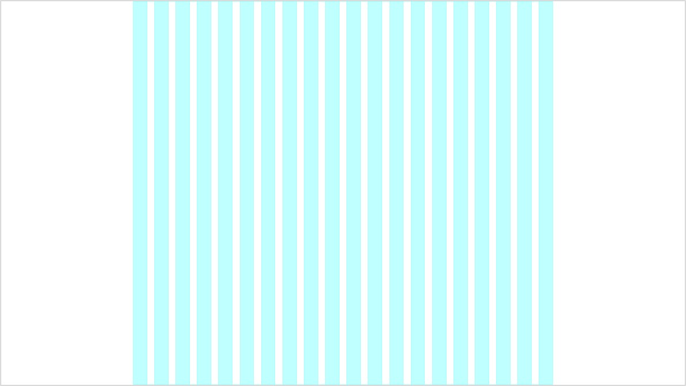
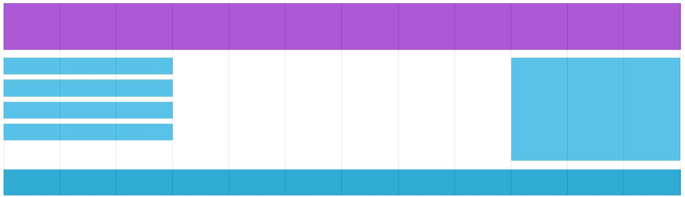

# Grid Frameworks
Die meisten Websites basieren heutzutags auf einem Grid-System. Damit ist gemeint, dass die Seite in verschiedene Spalten aufgeteilt ist:



Die Nutzung eines Grid-System ist sehr hilfreich bei der Gestaltung von Websites. Das Grid ermöglicht eine einfache Platzierung von Elementen auf einer Seite. Ebenfalls hilft es dabei die Ordnung und Konsistenz auf den verschiedenen Seiten einzuhalten:



[Die Grundlagen eines solchen Grid-Systems, sind auf diesem Beispiel sehr gut sichtbar.](https://www.w3schools.com/css/tryresponsive_grid.htm)

## Technische Umsetzung

Die Grundlagen eines Grid-Frameworks sind meistens mehrere vordefinierte CSS-Klassen. Mit Hilfe der Klassen kann der Inhalt der Seite einfach strukturiert werden:

```css
.col-1 {width: 8.33%;}
.col-2 {width: 16.66%;}
.col-3 {width: 25%;}
.col-4 {width: 33.33%;}
.col-5 {width: 41.66%;}
.col-6 {width: 50%;}
.col-7 {width: 58.33%;}
.col-8 {width: 66.66%;}
.col-9 {width: 75%;}
.col-10 {width: 83.33%;}
.col-11 {width: 91.66%;}
.col-12 {width: 100%;}
```

```html
<div class="row">
  <div class="col-3">...</div> <!-- 25% -->
  <div class="col-9">...</div> <!-- 75% -->
</div>
```

## Responsive Grid-System
Das Grid-System ermöglicht es nicht nur die Struktur des Inhaltes auf einem Anzeigegerät zu bestimmen, sondern dieses auch je nach grösse des Anzeigegerätes anzupassen:

```css
.col-1 {width: 8.33%;}
.col-2 {width: 16.66%;}
.col-3 {width: 25%;}
.col-4 {width: 33.33%;}
.col-5 {width: 41.66%;}
.col-6 {width: 50%;}
...

@media only screen and (max-width: 500px) { /* CSS-Regeln für Anzeigen < 500px Breite */
    .col-small-1 {width: 8.33%;}
    .col-small-2 {width: 16.66%;}
    .col-small-3 {width: 25%;}
    .col-small-4 {width: 33.33%;}
    .col-small-5 {width: 41.66%;}
    .col-small-6 {width: 50%;}
    ...
}
```

```html
<div class="row">
  <div class="col-3 col-small-6">...</div> <!-- Desktop: 25% | Mobile: 50% -->
  <div class="col-9 col-small-12">...</div> <!-- Desktop: 75% | Mobile: 100% -->
</div>
```

Ein Beispiel für eine Umsetzung befindet sich auf [dieser Seite](http://troolee.github.io/Gridstack.js/demo/responsive.html). Vergrössere und Verkleinere dazu das Browserfenster.
