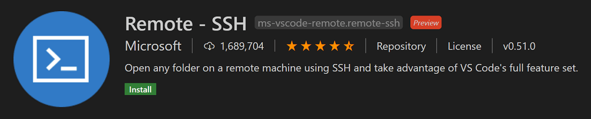
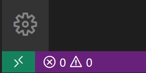
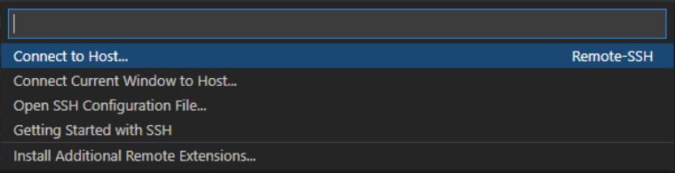

# Werkzeuge

## Editor & Konsole

Um produktiv arbeiten zu können, solltest du einen modernen Text-Editor verwenden. Welchen Editor und welche Konsole du für diesen ÜK verwendest, ist grundsätzlich dir überlassen. WYSIWYG-Editoren wie zum Beispiel Dreamweaver sind nicht erlaubt.

### Empfehlungen

Wir empfehlen wir in diesem Kurs mit dem [Visual Studio Code](https://code.visualstudio.com/) (VS Code) zu arbeiten. Natürlich gibt es auch viele andere tolle Editoren, aber in diesem Kurs werden sämtliche Arbeitsschritte mit diesem vorgezeigt und das VS Code hat bereits eine Konsole integriert. So musst du nur ein Programm installieren.

Solltest du dich für ein anderes Programm entscheiden, ist es in deiner Verantwortung dich um eine SSH-fähige Konsole zu kümmern und diese zu unterhalten.

#### Installation

1. Installer von [code.visualstudio.com](https://code.visualstudio.com/) herunterladen
2. Visual Studio Code installieren und starten
3. Bei den Plugins nach unten erwähnten Plugins suchen

### Plugins

Plugins sind Erweiterungen für deinen Code-Editor, um dir das Arbeiten etwas zu vereinfachen. Um Plugins zu installieren, gehe im Menü auf `File -> Preferences -> Extensions` (Ctrl + Shift + X). Du kannst jetzt den Namen eines Plugins eingeben und es über den «Install»-Button installieren.

#### Nützliche Plugins für Code-Bearbeitung

Folgende Plugins könnten für die nützlich sein:

| Plugin Name      | Beschreibung                                                                                                    |
|------------------|-----------------------------------------------------------------------------------------------------------------|
| PHP Intelephense | Autocomplete-Funktionen, die dir bei der Eingabe von PHP-Code helfen, kannst du über folgende Plugins erhalten. |
| CSS Formatter   | Ermöglicht das automatische Formatieren von CSS-Code.                                                           |

#### Bereits vorinstalliert: Emmet

Emmet ermöglicht es dir, einen CSS-Selektor via TAB-Taste in die entsprechende HTML-Struktur umzuwandeln.

```
a  -> TAB-Drücken

// ergibt:
<a href=""></a>
_____________________________

h1{Überschrift}+p{Absatz}  -> TAB-Drücken

// ergibt:
<h1>Überschrift</h1>
<p>Absatz</p>
_____________________________

ul>li{Punkt $}*3  -> TAB-Drücken

// ergibt:
<ul>
    <li>Punkt 1</li>
    <li>Punkt 2</li>
    <li>Punkt 3</li>
</ul>
```

### Konsole (Terminal)

Die Konsole, oder das Terminal, ist eine alternative Art einen Computer zu steuern. Anstelle von einer grafischen Benutzeroberfläche, werden bestimmte Befehle in der Konsole eingegeben und dann vom Computer verarbeitet.

Ein Beispiel: Du erstellst im Datei-Explorer den Ordner `Bilder`. Dies ist gleichbedeutend mit dem Konsolenbefehl `mkdir Bilder`.

#### SSH (Secure Shell)

In der Konsole kann ein `ssh` Programm benutzt werden, um eine Konsole auf einem anderen Computer/Server über das Netzwerk oder Internet zu öffnen. Dies ermöglicht dir, einen Computer fernzusteuern.

In unserem Fall benötigen wir die Konsole, um eine Verbindung mit dem Hosting-Server herzustellen, um darauf das CMS zu installieren und Änderungen am Code vorzunehmen oder lokale Dateien in das Dateisystem des Servers zu transferieren.

### Plugin: Remote-SSH

Um das Handling des Servers zu vereinfachen, bietet VS-Code das Plugin «Remote - SSH» an.



Sobald du das Plugin installiert hast, erscheint am unteren linken Rand des Fensters eine neue Statusbar:



Mit einem Klick auf die Statusbar können wir mit der Einrichtung der Verbindung zum Server starten:




#### SSH-Server hinzufügen
Mit einem Klick auf `+ Add News SSH Host...` kannst Du eine neue Server-Verbindung erfassen. Diese wird vom VS-Code gespeichert und kann anschliessend immer wieder genutzt/aufgebaut werden.

Die im nächsten Schritt benötigten Zugangsdaten findest du im Moodle. Trage diese anschliessend ein::

```shell
ssh benutzer@server
```

Als Nächstes fragt dich das VS-Code, wo die SSH-Konfiguration gespeichert werden soll. Hast entweder den Standardpfad bestätigen oder einen eigenen Speicherort wählen:

```shell
C:\Users\user\.ssh\config
```

#### SSH-Server verbinden
Nun können wir uns mit dem Server verbinden, indem wir die erfasste Server-Verbindung `benutzer@server` auswählen. Nun erscheint ein neues Fenster, wo wir das Betriebssystem des Zielservers angeben müssen. In unserem Fall handelt es sich um einen `Linux`-Server.

Anschliessend kannst du das Passwort eingeben. Das Passwort findest du ebenfalls im Moodle.


### Navigieren

Nach der erfolgreichen Verbindung mit dem Server sind wir nun im Home-Verzeichnis gelandet. Das Hosting ist so eingestellt, dass sämtliche HTTP-Aufrufe der Domain `m289-X.ch` ins `/public_html`-Verzeichnis geleitet werden. Um das Verzeichnis zu betreten, kann der `cd` (change directory) Befehl verwendet werden:

```shell
cd public_html
```

Anschliessend sollte die letzte Linie der Konsole so aussehen: `benutzer@server:[~/public_html]:`.

Mit dem `ls` (list directory contents) Befehl kannst du überprüfen, welche Dateien und Ordner bereits existieren:

```shell
ls
```
### Projektordner erstellen

Nun könnt ihr euren Projektordner mit dem `mkdir` (make directory) Befehl erstellen. Nehmt als Ordnernamen euren Projektnamen: 

```shell
mkdir mein-projekt
```

Anschliessend könnt ihr gleich mit dem cd-Befehl in den Ordner wechseln:

```shell
cd mein-projekt
```