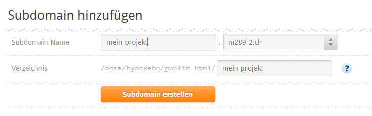

# Installation

### Datenbank

Bevor wir mit der Installation starten können, benötigen wir noch eine Datenbank. Diese lässt sich einfach über das Hosting-CP (Control Panel) erstellen. Die dazugehörigen Benutzerdaten findest du ebenfalls im Moodle.

Hier gelangst Du zum CP von Cyon: [https://my.cyon.ch/](https://my.cyon.ch/)

#### Datenbank erstellen

Wechsle nun im Reiter «Datenbank» auf den Punkt «MySQL»:

Dort kannst du anschliessend eine Datenbank erstellen. Der Prefix ist dabei bei allen gleich: `hosting_`. Wenn ihr die Datenbank nun nach eurem Gruppennamen benennt, entsteht folgender Datenbank-Name: `hosting_gruppename`.

Nach dem Hinzufügen der Datenbank werden euch die Benutzerdaten für die Datenbank im blauen Balken am oberen Bildschirmrand angezeigt. 
**Wichtig:** Kopiere das Passwort und notiere es Dir für die spätere Verwendung!

### Subdomain erstellen

Damit jedes Projekt über eine individuelle URL erreichbar ist, erstellen wir für jedes Projekt eine separate Subdomain. Wechsle nun im Reiter «Webhosting» auf den Punkt «Subdomains»:

Wähle anschliessend eine Subdomain und verweise bei Verzeichnis auf den vorher erstellen Projektordner (Achtung: Der Pfad in den `public_html` müsst ihr nicht nochmal eingeben!):

### SSL-Zertifikat aktivieren

Damit unsere Website später durch `HTTPS` geschützt ist, müssen wir im Reiter «Sicherheit» unter «Kostenlose SSL-Zertifikate» das SSL-Zertifikat der erstellten Subdomain noch aktiveren.

### Ready for take off

- [x] Via SSH mit Hosting verbunden
- [x] Projektordner erstellt
- [x] Datenbank für Projekt erstellt
- [x] Subdomain für Projekt erstellt (Projektordner hinterlegt)
- [x] SSL-Zertifikat für Subdomain erstellt

Nachdem wir nun sämtliche Vorbereitungsarbeiten erledigt haben, sind wir bereit für die Installation!

## CMS installieren

Nachdem wir nun den Server vorbereitet haben, können wir mit der Installation von October beginnen.

[Hier geht's zur offiziellen Installationsanleitung.](https://docs.octobercms.com/2.x/setup/installation.html)