# Backend
Als erstes erstellen wir dabei das Backend, in dem sollen die Fragen und Antworten erfasst, verwaltet, sortiert und gelöscht werden.

#### Schritt 1: Plugin erstellen
Als erstes erstellen wir das gewünschte Plugin. Dafür wählen wir den Builder im Backend aus und klicken auf den Pfeil auf der linken Seite:

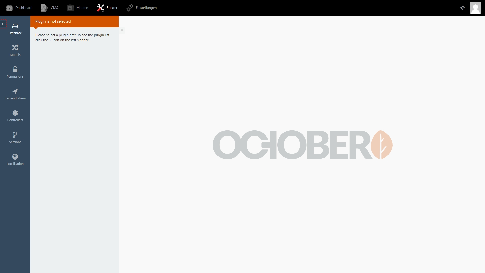

Anschliessend können wir mit `+ Create plugin` ein neues Plugin erstellen. Das Plugin benötigt dafür folgende Werte:

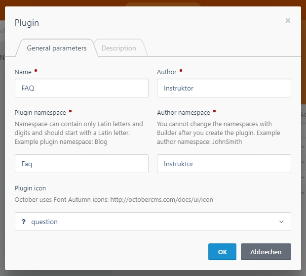

* `Name` - so soll euer Plugin heissen. Beispiele: FAQ, Team, Blog
* `Plugin namespace` - dies ist der technische Name eures Plugins. Der Namespace wird automatisch aus eurem Namen definiert und darf keine Sonder- oder Leerzeichen beinhalten.
* `Author` - hier wird der Autor des Plugins eingetragen (sollte für all eure Plugins der gleiche sein).
* `Author namespace` - dies ist der technische Name eures Autors. Der Namespace wird automatisch aus eurem Author definiert und darf keine Soder- oder Leerzeichen beinhalten.
* `Plugin icon` - ausserdem könnt ihr noch ein Icon für euer Plugin auswählen.

Mit einem Klick auf den Button `OK` wird das Plugin erstellt.

##### Schritt 2: Datenstruktur festlegen
Als nächstes überlegen wir uns, was für Daten mit dem Plugin gespeichert werden, welche Felder diese benötigen und welche Typen diese haben. In unserem Fall wären das Fragen bzw. `Questions`. Konkret müssen folgende Informationen pro Frage gespeichert werden:

| Information               | Typ         |
|---------------------------|-------------|
| Eindeutige Identifikation | Nummer      |
| Frage                     | Kurzer Text |
| Antwort                   | Langer Text |
| Reihenfolge               | Nummer      |

Nun können wir darauf die benötigten Felder für die MySQL-Datenbank ableiten:

| Information               | Typ         | Spaltenname (MySQL) | Typ (MySQL) | Nullable (MySQL) | Autoincrement | Primary Key |
|---------------------------|-------------|---------------------|-------------|------------------|---------------|-------------|
| Eindeutige Identifikation | Nummer      | id                  | integer     | false             | true          | true        |
| Frage                     | Kurzer Text | question            | string      | false            | false         | false       |
| Antwort                   | Langer Text | answer              | text        | false            | false         | false       |
| Reihenfolge               | Nummer      | sort_order          | integer     | true             | false         | false       |

* `sort_order` ist ein October CMS spezifischer Begriff, der uns hilft, damit die Einträge am Schluss sortierbar werden.
* `autoincrement` veranlasst, dass der wärt automatisch +1 hochgezählt wird: 1,2,3,4,5...
* Felder mit `nullable` dürfen entweder leer sein, weil sie nicht zwingen benötigt werden oder diese werden vom System automatisch generiert (ID und Reihenfolge).

Jetzt können wir also die Tabelle erstellen, in dem wir unter Database auf `+ Add` klicken. Dort können wir den vorgenerierten Tabellennamen mit unserer Tabellenbezeichnung ergänzen und die Struktur definieren. Der Wert `Length` wird dabei vom October CMS selber ausgefüllt.

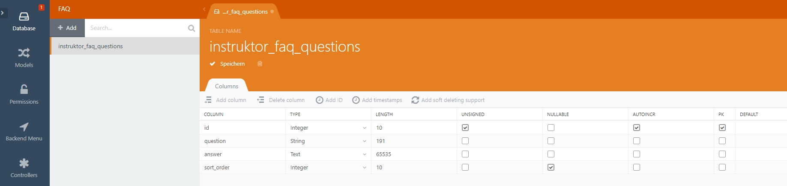

Mit Klick auf `Speichern` und Bestätigung der Meldung wird die Tabelle erstellt.

#### Schritt 2: Model erstellen
Im October CMS stellt jeder Datenkbank eintrag ein sogenanntes Model dar. Dieses müssen wir nun erstellen und definieren, in dem wir auf dem Menüpunkt `Models` klicken und dort auf `+add`.

Anschliessend müssen wir dem Model einen Namen geben. Im Idealfall steht der Name für einen einzelnen Eintrag in unserer Tabelle. In unserer Tabelle sind also mehrere Fragen gespeichert, entsprechend steht ein Model für eine Frage bzw. `Question`. Die Bezeichnung muss dabei immer Einzahl und mit einem grossgeschriebenen Anfangsbuchstabe sein.

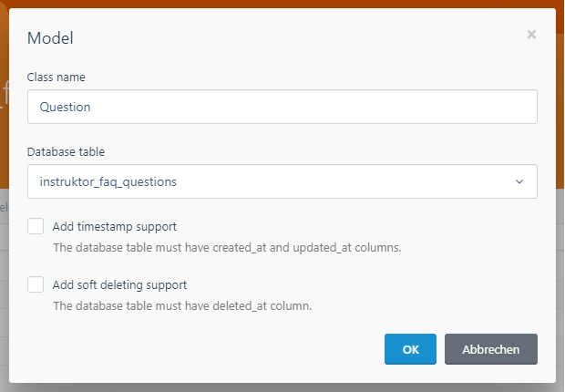

Auf der linken Seite erscheint nun im grauen Bereich das Model und dazugehörig folgende Bereiche:

* `Forms` - In diesem Bereich können die Formulare für das erstellen, bearbeiten und löschen von einzelnen Einträgen (Models) definiert werden.
* `Lists` - In diesem Beriech können Listen definiert werden, in denen die Models angezeigt werden.

##### Forms

Wir klicken nun auf das `+` hinter dem Begriff Forms und erstellen eine Bearbeitungsmaske. Dafür erstellen wir sämtliche Eingabefelder, die für das Model benötigt werden. In unserem Fall wären das also:

* `Textfeld` - mit dem die Frage erfasst und bearbeitet werden kann.
* `Grösseres Textfeld mit Formatierung` - mit dem die Antwort erfasst und bearbeitet werden kann.

Um ein Feld zu erstellen kannst du auf `+ Add control` klicken und das gewünschte Feld auswählen. In unserem Fall wäre das also ein Feld `Text` für die Frage:

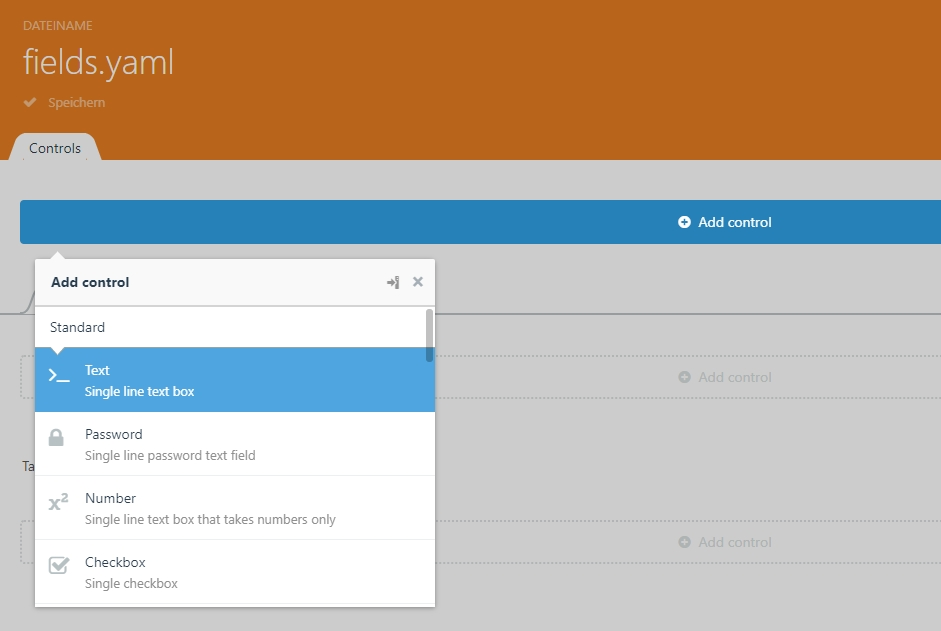

Anschliessend kannst du die Parameter zu diesem Feld definieren:

* `Field name` - definiert, zu welcher Spalte in der Datenbank das Feld gehört.
* `Label` - Wird oberhalb des Feldes angezeigt, damit der Administrator weiss, welchen Wert er eintragen muss.

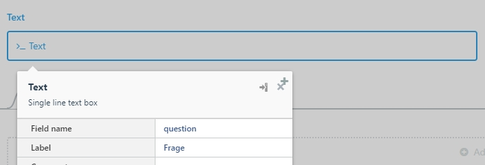

Das Gleiche kannst du jetzt auch noch mit dem Feld für die Antwort mit dem Typ `Rich Editor` machen.

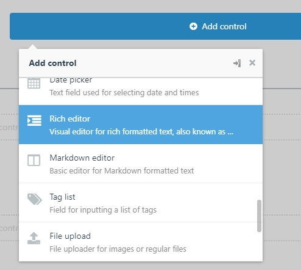
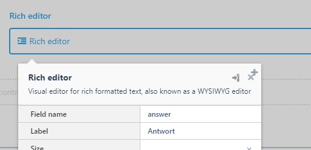

Damit können wir die Form abschliessen und speichern.

##### Lists

Nun können wir noch eine Liste erstellen, in der alle Fragen angezeigt und ausgewählt werden können. Dazu klicken wir auf das `+` hinter dem Begriff Lists und definieren die Felder, welche angezeigt werden sollen. Dabei geht es um die Übersicht, Felder die zu viel Inhalt haben (Antwort) oder dem Benutzer nichts sagen (ID), müssen nicht angezeigt werden.

Mit dem Checkboxen in jeder Zeile können wir noch bestimmen, ob die Informationen durchsuchbar, versteckt und sortierbar sind.

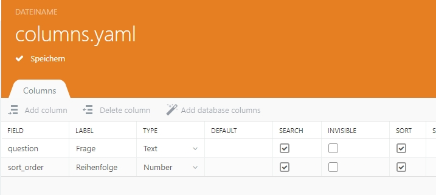

Damit können wir die Liste abschliessen und speichern.

#### Schritt 3: Backend Menu
Nun geht es darum, den Menüpunkt für das Plugin zu erstellen. Unter `Backend Menu` kannst du dazu einfach `+ Add main menu item` auswählen, eine passende Bezeichnung eingeben und ein Icon auswählen.

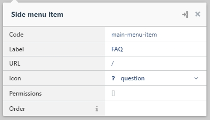

#### Schritt 4: Controller erstellen
Sowie das Model stellvertretend für einen einzelnen Listeneintrag steht, so steht der Controller für alle Einträge in einer Liste und deren Verhalten. Entsprechend können wir im Bereich Controller mit `+ Add` einen Controller hinzufügen. Dessen Bezeichnung ist immer die Mehrzahl vom dazugehörigen Model (bei uns `Question`) und der erste Buchstabe ist ebenfalls grossgeschrieben. In unserem Beispiel wäre das also: `Questions`. 

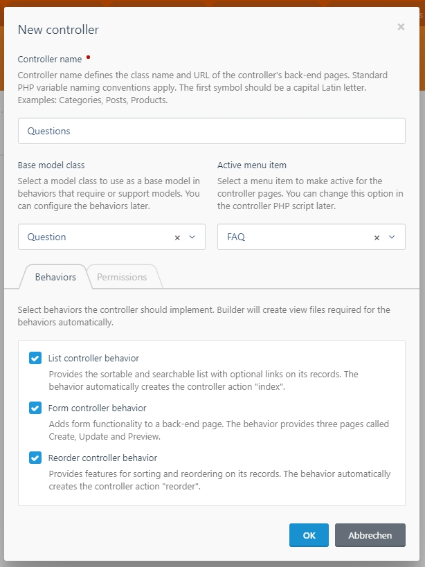

Neben dem Namen erwartet der Builder noch andere Informationen:

* `Base model class` - zu wechem Model gehört der Controller. Bei unserem Beispiel: Question
* `Active menu item` - zu welchem Menü-Item gehört der Controller. Bei unserem Beispiel: FAQ
* [ ] `List controller behaviour` - gibt es eine Liste zu diesem Controller. In unserem Fall: Ja
* [ ] `Form controller behaviour` - gibt es ein Formular zu diesem Controller. In unserem Fall: Ja
* [ ] `Reorder controller behaviour` - können die Einträge über das Feld `sort_order` sortiert werden. In unserem Fall: Ja

Mit einem Klick auf `OK` kann der Controller erstellt werden und die angewählten Behaviours werden angezeigt.

Damit bei der Sortierung die richtigen Informationen angezeigt werden, muss im `Form controller behaviour` der `Attribute name` angepasst werden mit dem Feld, dass bei der Sortierung sichtbar ist:

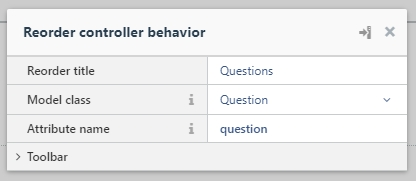

Abschliessend kann der Controller noch mit dem `Backend Menu` verlinkt werden. Dazu wird der erstellte Menüpunkt nochmals bearbeitet und bei der `URL` der author-namespace, der plugin-namespace und der controller-name eingetragen werden.

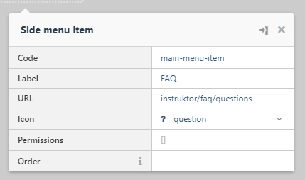

#### Schritt 5: Reihenfolge aktivieren
Nach einem Seitenrefresh (F5) sollte das Plugin im Menü ersichtlich sein. Einträge können nun erstellt werden, jedoch muss die automatische Verwaltung von der Reihenfolge im October noch aktiviert werden.

Navigiere dazu im Plugins-Ordner zur Datei mit der Bezeichnung deines Models im Ordner `Models`. 

In unserem Fall: `~\plugins\dein-author-namespace\faq\models\Question.php`

Die Datei kannst du einfach mit folgendem Code ergänzen auf Zeile 11 ergänzen:

`use \October\Rain\Database\Traits\Sortable;`

Das ganze sieht dann so aus:

```php
<?php namespace Instruktor\Faq\Models;

use Model;

/**
 * Model
 */
class Question extends Model
{
    use \October\Rain\Database\Traits\Validation;
    use \October\Rain\Database\Traits\Sortable;
    
    /*
     * Disable timestamps by default.
     * Remove this line if timestamps are defined in the database table.
     */
    public $timestamps = false;


    /**
     * @var string The database table used by the model.
     */
    public $table = 'instruktor_faq_questions';

    /**
     * @var array Validation rules
     */
    public $rules = [
    ];
}
```

#### Fertig
So nun haben wir alles soweit vorbereitet, dass ihr in eurem Backend Fragen erfassen, verwalten, sortieren und löschen könnt.


