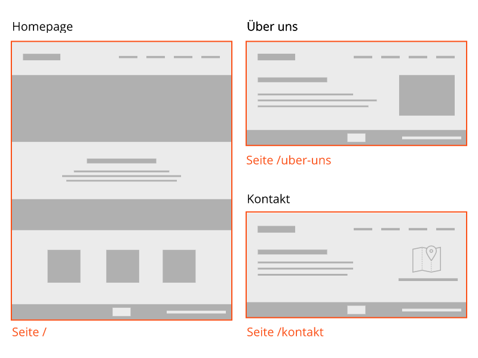

# Seiten (Pages)

Eine Seite gehört zu einem Layout. Jede Seite hat einen eigenen Titel und eine eigene URL, die direkt über den Webbrowser aufrufbar ist.

Im Beispiel unten handelt es sich um drei Seiten, die zwei Layouts verwenden.

