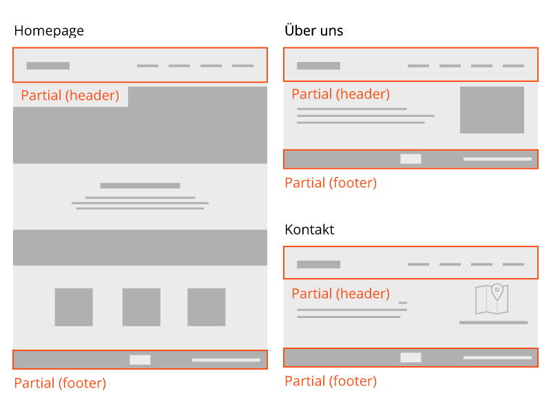

# Partials

Partials sind einzelne Elemente in eurem Theme, die an verschiedenen Orten wiederverwendet werden. Damit die Duplizierung von Code verhindert wird, können diese Elemente in Partials ausgelagert werden.

Ein Partial kann beliebig viele weitere Partials enthalten.

Partials werden von dir als Entwickler bereitgestellt. Der Endandwender sollte Partials nie selber bearbeiten müssen.

