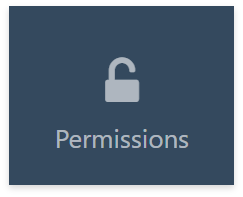
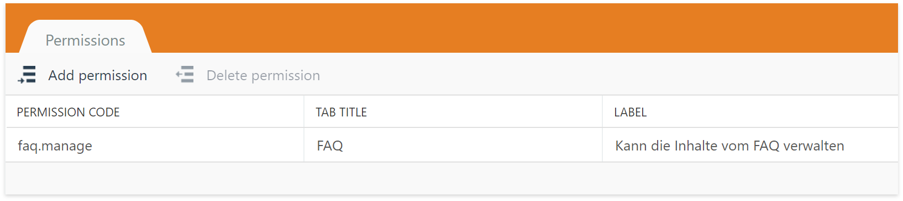
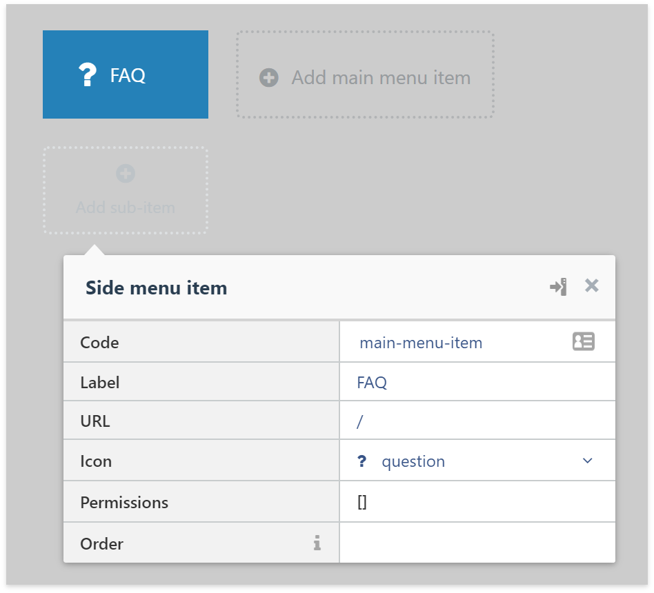
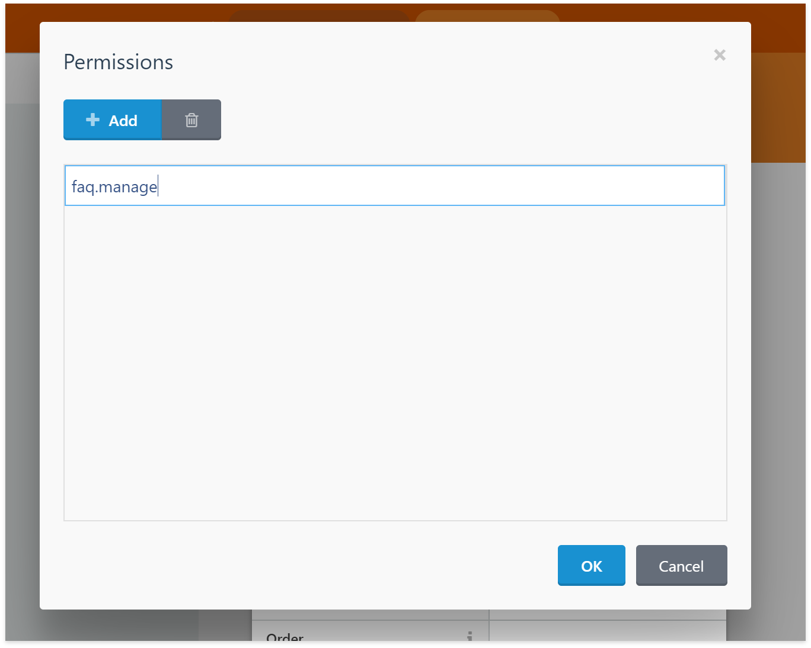
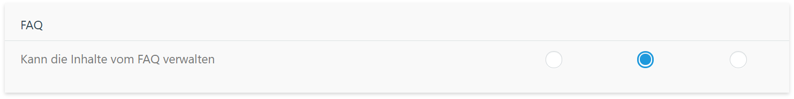

# Backend: Berechtigungen für Plugin

Aktuell haben noch alle Benutzer Zugriff auf unser Plugin. Wie wir dies ändern können, wird in folgenden Schritten erklärt:

### Schritt 1: Permission erstellen
Auf der linken Seite könnt ihr den Menüpunkt Permissions auswählen. 

Anschliessend erscheint auf der rechten Seite eine Tabelle, in der sich die Berechtigungen erfassen lassen.

* `Permission Code` - In diesem Feld erhält die Berechtigung eine eindeutige Kennung (eine ID). Mit dieser Kennung entscheidet das System, ob ein Nutzer die Berechtigung für eine Funktion hat oder nicht.
* `Tab Title` - Die Berechtigungen werden auf der Berechtigungsübersicht in unterschiedliche Tabs unterteilt, für eine bessere Übersicht. Hier könnt ihr also entscheiden, wie der Übertitel der Berechtigung heisst. 
* `Label` - Wird auf der Berechtigungsübersicht angezeigt, damit der Administrator weiss, was diese Berechtigung steuert.

### Schritt 2: Berechtigung zuweisen
Nun gehen wir zurück ins Backend Menu und klicken dort auf den Menüpunkt, der nur mit der gerade erstellten Berechtigung zugänglich sein soll. Folgende Dialogbox erscheint nun:

Mit einem Klick auf den Wert beim Punkt «Permissions» erscheint nun eine Auswahlbox für die Berechtigungen:

Dort könnt ihr nun den vorhin bestimmten `Permission Code` eingeben, damit dieser Menüpunkt nur noch mit der definierten Berechtigung zugänglich ist.

### Schritt 3: Berechtigung setzen
Nun müssen wir die Berechtigung noch setzen. Geht dazu auf `Einstellunen` > `Administratoren` und wählt dort einen Benutzer von euch (ausser den Admin, der darf ja eh alles).

Unter dem Reiter `Rechte` sollte nun das Tab sichtbar sein und ihr könnt die Berechtigung entweder vergeben, vererben oder verbieten:

### Törööö!
Nun hast Du auch bei einen Plugins im Griff, wer darauf zugreifen darf und wer nicht.
