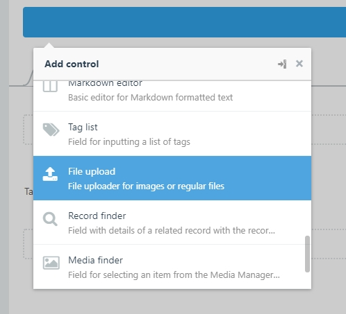
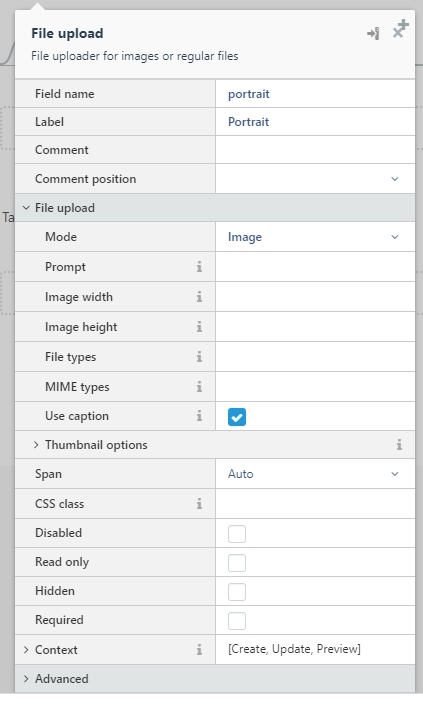

# Backend: Bilder ins Plugin einfügen

Um Bilder in einem Plugin einzufügen, benötigt es folgende Anpassungen:

### Schritt 1: Feld im Backend erstellen
Um Bilder für einen Eintrag zu erfassen, braucht es **kein** neues Feld in der Datenbank. Du kannst einfach via `Builder` -> `Models` -> `Forms` ein File-Upload-Feld erstellen:



Folgende Informationen müssen dabei erfasst werden:



* `Field name` - bei Field name könnt ihr dem Feld einen eindeutigen Namen geben. Da es kein Feld dazu in der Datenbank gibt, kann dieser Name frei definiert werden. Der Name muss jedoch kleingeschrieben und ohne Sonderzeichen sein.
* `Label` - Wird oberhalb des Feldes angezeigt, damit der Administrator weiss, welchen Wert er eintragen muss.
* `File upload` > `Mode` - könnt hier noch angeben, ob man über das Uploadfeld nur Bilder (Image) oder allgemein Dateien (File) hochladen kann.

### Schritt 2: Beziehung zum Model erstellen
Damit das Model nun weiss, dass es beim Erstellen und Bearbeiten ein Bild erwarten muss. Müssen wir dies noch im Code des Models hinterlegen.

Navigiere dazu im Plugins-Ordner zur Datei mit der Bezeichnung deines Models im Ordner `Models`. 

Die Datei kannst du einfach mit folgendem Code nach Zeile 29 ergänzen:

```php
public $attachOne = [
    'fieldname' => 'System\Models\File'
];
```

Der Schlüssel des Arrays (`fieldname` in unserem Beispiel) muss dem `Field name` entsprechenden, den wir unserem Feld zugewiesen haben. In unserem Fall also:

```php
public $attachOne = [
    'portrait' => 'System\Models\File'
];
```

Oder in der Gesamtübersicht vom Model:

```php
<?php namespace Instruktor\Team\Models;

use Model;

/**
 * Model
 */
class Person extends Model
{
    use \October\Rain\Database\Traits\Validation;
    use \October\Rain\Database\Traits\Sortable;
    
    /*
     * Disable timestamps by default.
     * Remove this line if timestamps are defined in the database table.
     */
    public $timestamps = false;


    /**
      * @var string The database table used by the model.
      */
     public $table = 'instruktor_team_person';
 
     /**
      * @var array Validation rules
      */
     public $rules = [
     ];

     public $attachOne = [
        'portrait' => 'System\Models\File'
     ];
 }
```

### Tadaaaa!
Nun kannst du in deinem Model Bilder oder Dateien hochladen!
