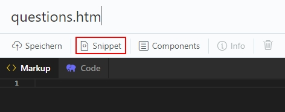
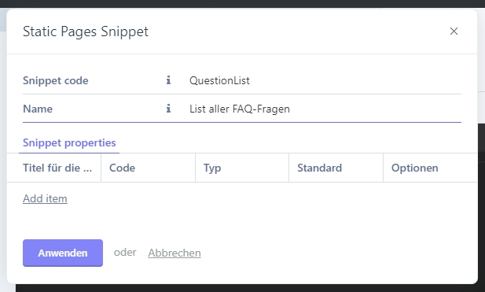
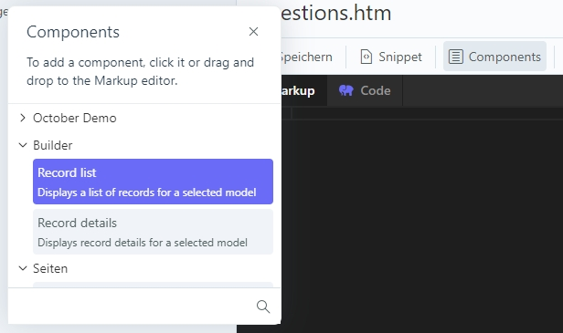
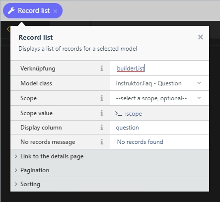
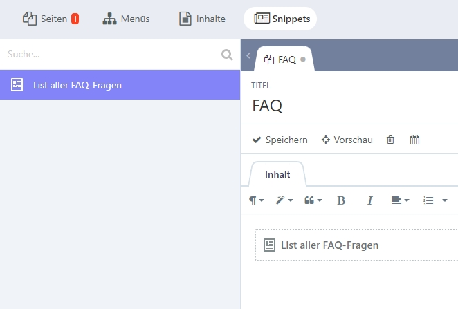
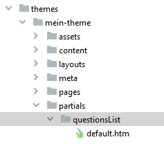

# Frontend
Die Daten sind nun also sortiert in unserer Datenbank. Jedoch wollen wir diese nicht nur speichern sondern auch im Frontend anzeigen. Wiederum unterstützt uns der Builder:

#### Schritt 1: Partial erstellen
Gehe ins Backend und erstelle ein Partial, in dem du deine Inhalte auflisten möchtest.

* `Dateiname` - gib dem Partial einen Dateinamen. Der Name wird nirgends angezeigt, jedoch die Informationen werden aus dem Partial werden in dieser Datei gespeichert.

Öffne nun die Snippet-Einstellungen:


 
* `Snippet code` - gib dem Partial einen **eindeutigen** Snippet code. Mit diesem kann dein Partial und somit auch die Inhalte aus deinem Plugin auf im Static Pages genutzt werden.
* `Name` - gib deinem Partial einen Namen, damit du dieses später im Static Pages identifizieren kannst.



#### Schritt 2: Builder-Komponente einfügen
Nun kannst du links auf Komponenten klicken und die `Builder > Record list` per Drag&Drop in den Markup-Bereich deines Partials ziehen.



#### Schritt 3: Builder-Komponente konfigurieren
Um der Biulder-Komponente mitzuteilen, welche Liste diese anzeigen soll, kannst du einfach auf die `Record list` Komponente in der orangen Fläche klicken. Nun kannst du unter anderem folgende Einstellungen vornehmen:





* `Verknüpfung` - das ist ein Alias, um später via Twig auf die Daten zuzugreifen.
* `Model class` - hier kannst du definieren, welche Daten aus der Datenbank abgefragt werden sollen.
* `Display column` - eine Spalte aus der Tabelle, die standardmässig angezeigt werden soll.
* `No records message` - diese Nachricht wird angezeigt, wenn die Komponente keine passenden Daten in der Datenbank findet.

**ACHTUNG:** Wenn die Verknüpfung geändert wurde, muss auch die Bezeichnung im Markup angepasst werden. In unserem Beispiel also: ``

#### Schritt 4: Komponente platzieren
Nun kannst du die Komponente beliebig in deinem Layout, einer CMS Seite oder einer Static Page (über Snippets) platzieren.

Hier ein Beispiel für eine Static Page:



#### Schritt 5: Komponente überlagern
In 99% aller Fälle reicht das Standard-Layout der Komponente nicht aus. Entsprechend wollen wir dieses überlagern. Dies funktioniert gleich wie bei den installierten Plugins in dem wir ein gleichnamiges Partial (gleich wie die Verknüpfung) im Theme-Ordner erstellen: 



Die im Partial enthaltene `default.htm`-Datei überlagert die standardmässige Darstellung der Komponente.

#### Schritt 6: Komponente individualisieren
Die Daten können jetzt im `default.htm` einfach über die Komponenten-Variable `records` aufgerufen werden:

``{{ __SELF__.records }}``

Wenn wir die Fragen also als Liste ausgeben wollen, können wir das nötige HTML einfach drumherum bauen:

```twig
<ul>
    
        <li>
            <strong>{{ record.question }}</strong><br>
            {{ record.answer | raw }}
        </li>
    
</ul>
```

Ausserdem kannst Du auch die anderen Parameter aus deiner Komponente im Twig verwenden, wie zum Beispiel die `noRecordsMessage`:

```twig
<ul>
    
        
            <li>
                <strong>{{ record.question }}</strong><br>
                {{ record.answer | raw }}
            </li>
        
    
        {{ __SELF__.noRecordsMessage }}
    
</ul>
```
