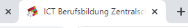

# Meta-Tags
Metainformationen sind Information über Informationen. Somit geben die Meta-Tags Information über die Informationen auf einer Website.

Die beiden wichtigsten sind dabei die der Titel und die Description:

### Title-Tag

`<title>Das ist der Titel der Website</title>`

* ist ein Rankingfaktor
* wird im Suchergebnis als Titel angezeigt

Der Seitentitel erscheint im Tab:



Und im Suchresultat:


### Meta-Description

`<meta name="description" content="Hier steht die Meta-Description."> `

* kurze Beschreibung der Seite
* erscheint in den Suchresultaten unter Titel und URL, falls passend

Die Meta-Description erscheint dann beim Suchresultat:


### `noindex` Meta-Tag

Nicht alle Seiten einer Website sollen in den Suchresultaten auffindbar sein. Um eine spezifische Seite komplett von der Indexierung durch Suchmaschinen auszuschliessen, kann folgendes Tag im `<head>` Tag der Seite platziert werden:

```html
<meta name="robots" content="noindex">
```

#### Umsetzung im October CMS

```html
<title>{{ this.page.meta_title | default(this.page.title) }}</title>
<meta name="description" content="{{ this.page.meta_description }}">
```

Die beiden Felder `page.meta_title` und `page.meta_description` können im Backend im CMS-Bereich bei jeder Seite über den «Meta»-Tab ausgefüllt werden.

Beim obenstehenden Beispielcode wird für den Titel das `meta_title` Feld verwendet, falls vorhanden. Ansonsten wird der einfache Seitentitel verwendet. In gewissen Situationen ist es von Vorteil, wenn für die Suchmaschine ein anderer Seitentitel definiert werden kann, als für die Anzeige im Browser-Tab. 
